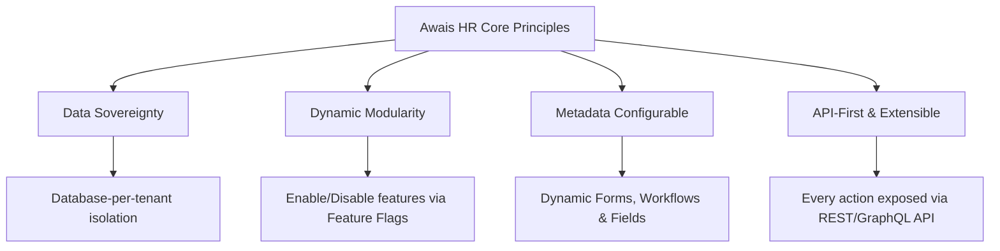
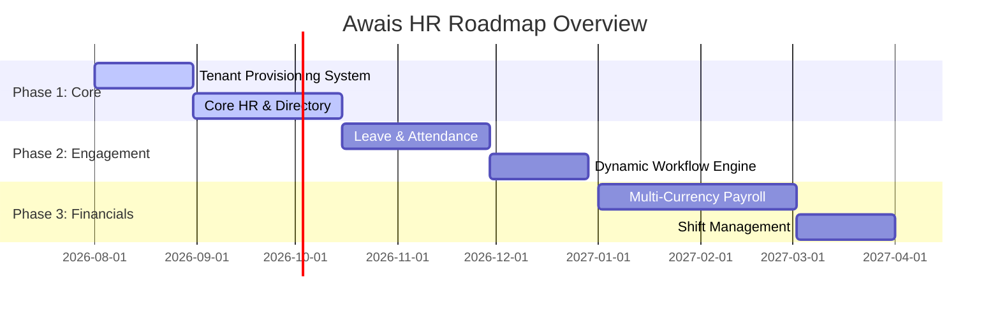

# Project Vision: Awais HR Enterprise Platform

This document defines the high-level business and product vision for **Awais HR**, an enterprise-grade multi-tenant SaaS HR platform. It serves as the foundation for all engineering, product, and design decisions.

---

## Executive Summary

Awais HR is designed to be the next-generation global human resource management system (HRMS). Unlike legacy systems that require heavy customization, manual database provisioning, or static single-tenant hosting models, Awais HR is built as a cloud-native, modular, database-per-tenant platform that dynamically adapts to small-to-midsize businesses (SMBs) and large multi-national enterprises alike.

By decoupling the data layers per company and using Host Header resolution, Awais HR solves security, GDPR/compliance, and scalability concerns. By supporting flexible module provisioning and industry template configurations, the platform avoids code bloat and delivers custom-fit HR workflows for sectors ranging from healthcare and manufacturing to IT and NGOs.

---

## The Core Problem & Market Opportunity

Existing HR software is fragmented, expensive, and rigid:
1. **The Core Data Security Dilemma:** Traditional SaaS HR platforms mix tenant data in shared databases. This leads to concerns over data isolation, cross-tenant leaks, and complex regulatory compliance (e.g., GDPR, HIPAA, SOC 2).
2. **Modular Inflexibility:** Platforms like Workday are too heavy and expensive for SMBs, while platforms like BambooHR lacks the modular extensibility and complex payroll engines required by manufacturing, retail, or multi-national organizations.
3. **Rigid Configuration:** Legacy platforms hardcode fields (e.g., "Social Security Number" instead of generic national identifiers), making international expansion or multi-industry customization slow and error-prone.

### Competitor Landscape Matrix

| Competitor | Target Segment | Strengths | Vulnerabilities / Awais HR Edge |
| :--- | :--- | :--- | :--- |
| **Rippling** | Mid-market tech | Great IT/device management, unified employee graph. | Hard to scale for heavy shift-work/non-desk industries (healthcare, hospitality). High cost. |
| **BambooHR** | SMB (50–500) | Easy UI, fast onboarding, simple core directory. | Lacks multi-entity support, localized complex payroll, shift-scheduling, and high-volume performance. |
| **Darwinbox** | Large Enterprise (Asia) | Mobile-first, strong localization, custom workflows. | Legacy infrastructure, complex configuration, high support overhead, not easily self-serve. |
| **HiBob** | Mid-market global | Modern UI, cultural features, global employee profile. | Weak scheduling and project tracking modules, struggles with complex manufacturing rules. |
| **Deel / Remote** | Global contractors | Excellent localized EOR/Payroll and contract compliance. | High contractor fee markups, basic internal core HR and shift planning tools. |

---

## Target Audience & Industry Segmentation

Awais HR addresses organizations across the entire growth curve:
*   **SMBs (10–100 employees):** Need instant out-of-the-box templates, automated onboarding, self-serve portals, and simple leave tracking.
*   **Mid-Market (100–1000 employees):** Require multi-branch rules, payroll processing integrations, shift scheduling, and recruitment modules.
*   **Enterprises (1000+ employees):** Require custom domain mapping, database-per-tenant isolation for strict security audits, SAML/SSO integration, custom approval chains, and multi-currency payroll.

### Supported Vertical Industries & Templates

Awais HR does not use hardcoded configurations. Instead, it leverages metadata-driven templates to dynamically enable modules and pre-configure standard fields:
*   **IT & Software Houses:** Focuses on Performance Management, Projects/Timesheets, Core HR, and Hybrid Work Tracking.
*   **Healthcare & Hospitals:** Focuses on License/Certification Tracking, Shift Scheduling, Nurse/Doctor Scheduling, and Strict Security logs.
*   **Manufacturing & Logistics:** Focuses on Shift Rotations, Attendance tracking (geofenced mobile/biometric check-ins), overtime rules, and health & safety compliance.
*   **Restaurants & Hospitality:** Focuses on Shift Management, Tip Sharing, Payroll adjustments, and high-turnover onboarding flows.

---

## Core Product Principles

Every architectural and coding standard within the platform must align with these core tenets:

### 1. Zero Shared Data (Data Sovereignty)
To achieve ultimate compliance (GDPR, SOC 2, HIPAA, and national storage laws), each customer company is provisioned with its own SQL database. The master database stores only routing, billing, and registration details. No tenant data is stored or queried globally.

### 2. Extensible Modularity
Core HR is the baseline requirement. All other capabilities (Payroll, Recruitment, Help Desk, etc.) are treated as independent modules. Databases support modular migrations (Flyway) triggered dynamically upon module purchase.

### 3. Absolute Configuration Over Customization
Hardcoding is forbidden. Standard HR concepts (e.g., Leave Types, Shift Patterns, Pay Structures, Custom Fields) must be metadata-driven. Organizations can create their own database columns or fields at runtime via a JSON-metadata schema mechanism.

### 4. API-First Architecture
The frontend web application, mobile app, and external integrations communicate via a single API Gateway using identical REST endpoints. This ensures developers can write integrations without requiring special access.

---

## High-Level Execution Phases

1.  **Phase 1 (Foundational Infrastructure):** Master DB architecture, dynamic Host Header routing, automated tenant database provisioning, Core HR, and simple custom domain mapping.
2.  **Phase 2 (Workforce Management):** Leave tracking, Attendance with geofencing, Shift Management, and the Event-driven Notification Engine.
3.  **Phase 3 (Financials & Performance):** Global multi-currency Payroll engine, recruitment pipelines, and performance reviews.
