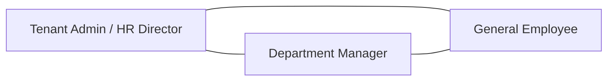
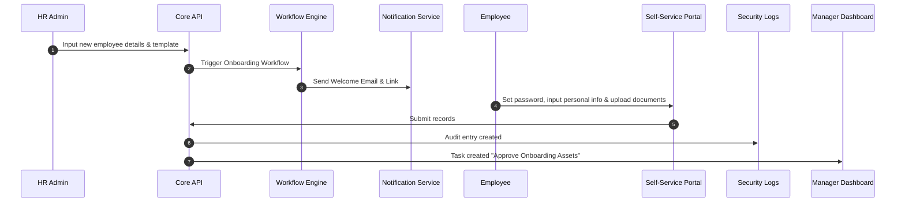
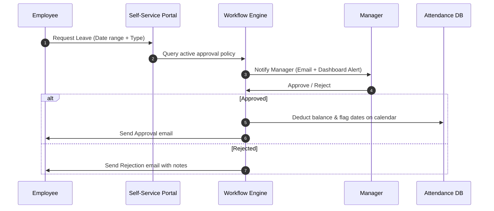

# Product Requirements Document (PRD): Awais HR

This document details the functional specifications, product requirements, user personas, workflows, and acceptance criteria for **Awais HR**.

---

## 1. Document Control & Versioning

| Version | Date | Authors | Status | Description |
| :--- | :--- | :--- | :--- | :--- |
| `v1.0.0` | 2026-07-17 | Product & Architecture Board | Approved | Initial draft for Master Product Baseline |

---

## 2. Product Vision & Goals

Awais HR is designed to replace fragmented legacy HR systems with a modular, highly scalable, and secure SaaS solution. The business goals are:
*   **Time-to-Value:** Automated self-serve tenant onboarding in under 3 minutes.
*   **Zero Operations Intervention:** Automatically provision databases, run schemas, and seed custom presets based on industry templates.
*   **Compliance Readiness:** Satisfy GDPR, SOC 2, and local data protection regulations out of the box through physical database isolation.

---

## 3. Customer Personas

We target three primary user groups:

### Persona A: Sarah (HR Director / Tenant Admin)
*   **Role:** Oversees global HR operations for a 500-employee manufacturing firm with office and deskless workers.
*   **Pain Points:** Spends hours managing manual rosters, adjusting local tax settings in payroll, and dreads data breaches because employee details are stored in unified databases.
*   **Needs:** Dynamic custom fields, audit logs of all actions, robust shift planning, automatic payroll calculation, and total control over data exports.

### Persona B: David (Engineering Manager / Department Lead)
*   **Role:** Leads a 25-person remote software engineering department.
*   **Pain Points:** Tracking team availability, approving leaves across multiple time zones, and conducting monthly performance reviews.
*   **Needs:** Easy dashboard for team leave schedules, simple performance review inputs, and clear task allocations.

### Persona C: Elena (General Deskless Employee)
*   **Role:** Warehouse operations lead.
*   **Pain Points:** No company laptop. Checking rosters or submitting leaves requires calling HR. Can't see payslips easily.
*   **Needs:** Mobile-responsive self-service portal, clock-in/out via mobile with geofencing, and immediate access to payslips.

---

## 4. Module & Feature Scope Matrix

Core HR is the baseline mandatory module. All other modules are toggled at the tenant level.

| Module | Core Features | Status |
| :--- | :--- | :--- |
| **Core HR (Mandatory)** | Employee Directory, Dynamic Profiles, Custom Fields, Document Management, Org Chart. | Core |
| **Attendance & Leave** | Clock-in/out (IP & Geofenced), Shift patterns, Accrual policies, Leave requests. | Optional |
| **Payroll Engine** | Dynamic salary components, Tax formulas, Multi-currency, Payslip generation. | Optional |
| **Shift Management** | Drag-and-drop rostering, Open shift claims, Overtime calculations, Shift swaps. | Optional |
| **Recruitment** | ATS pipelines, Candidate database, Job portals, Resume parsing, Interview loops. | Optional |
| **Performance Management** | OKR tracking, 360-degree reviews, Performance reviews, Calibration. | Optional |
| **Expense & Asset Management**| Asset assignment, Expense claims, Approval chains, Receipt OCR scan. | Optional |
| **Workflow Engine** | Dynamic approval logic, Conditional triggers (e.g. Leave approval chain by salary grade).| Core |
| **SaaS Subscription Billing** | Multi-tier plans, Usage/Seat pricing, Provider-agnostic gateway integration, Invoicing, Refunds. | Core (Master) |
| **Payroll Disbursement** | Multi-bank API adapters, Wise/Payoneer/ACH/SEPA routing, Batch approval workflows, Reconciliation.| Optional (Tenant)|

---

## 5. Functional Requirements (Detailed Specifications)

### 5.1. Core HR & Employee Directory
*   **Dynamic Custom Fields:** Admins can define fields at runtime (e.g., `national_id_jp`, `tshirt_size`). The database must store this as structured metadata (JSONB) or schema-extended columns.
*   **Document Vault:** Employee profiles must feature secure file storage for contracts, IDs, and certificates, encrypted using Envelope Encryption.

### 5.2. Leaves & Time Off (Accrual & Policies)
*   **Policy Engine:** Admins can create leaf rules (e.g., "Accrue 1.5 days of annual leave per month, cap carryover at 5 days").
*   **Approval Chains:** Leave requests must trigger workflows defined in the dynamic Workflow Engine.

### 5.3. Attendance Tracking
*   **Clock Mechanisms:** Web UI, Mobile GPS Geofencing, and Biometric API Integration.
*   **Anomalies Detection:** Automated flags for late arrival, early departure, missing checkout, and clock-ins outside of approved geofences.

### 5.4. Global Payroll Engine
*   **Salary Components:** Base Salary, Custom Allowances (taxable/non-taxable), Deductions (statutory & voluntary).
*   **Tax Formula Engine:** A configurable syntax compiler (using simple scripting or expressions) to define payroll tax calculation logic based on local jurisdiction.

### 5.5. Enterprise SaaS Subscription Billing (Payment Domain 1)
*   **Multi-Tier Plan Matrix:** Supports Free Trial (14-day), Starter, Professional, Enterprise, Custom Quotation, and Build Your Own (modular) pricing models.
*   **Billing Models:** Employee/seat-based pricing, module-based add-ons, and usage-based overage metering (API calls, document storage).
*   **Billing Lifecycle:** Supports monthly/annual cycles, auto-renewals, 7-day grace periods, immediate/end-of-cycle upgrades & downgrades, pause/resume, cancellations, coupons, taxes (VAT/GST/reverse charge), invoices, refunds, and credit notes.
*   **Provider-Agnostic Integration:** Decoupled billing framework supporting Stripe, Paddle, Lemon Squeezy, PayPal, and regional gateways via adapter interfaces with full webhook, status sync, idempotency, and audit trail support.

### 5.6. Tenant Payroll Salary Disbursement Framework (Payment Domain 2)
*   **Non-Financial Custody:** The HR SaaS engine never holds or directly transfers tenant funds. It acts strictly as an orchestrator and monitoring integration hub.
*   **Tenant Provider Autonomy & Isolation:** Each tenant independently configures their preferred disbursement provider (Bank APIs, Wise Business, Payoneer, ACH, SEPA, Local ISO 20022 Bank APIs, Digital Wallets) with encrypted credentials stored in isolated tenant key vaults.
*   **Batch Orchestration Workflow:** Standardized 9-step pipeline: `Generate Payroll` $\rightarrow$ `Approve Payroll (MFA)` $\rightarrow$ `Create Payment Batch` $\rightarrow$ `Send Batch to Provider API` $\rightarrow$ `Receive Provider Response` $\rightarrow$ `Track Payment Status` $\rightarrow$ `Reconcile Transactions` $\rightarrow$ `Generate Payslips` $\rightarrow$ `Notify Employees`.
*   **Enterprise Resilience & Security:** Provider abstraction layer utilizing Adapter & Strategy design patterns, circuit breakers, queue-based background processing (RabbitMQ), idempotency keys, OAuth token refresh, MFA approval enforcement, and audit logs.

---

## 6. Business Workflows

### 6.1. Employee Onboarding Workflow

### 6.2. Leave Request Workflow

---

## 7. Non-Functional Requirements (NFR)

### 7.1. Performance & Scale
*   **API Response Time:** 95% of read requests must resolve under 150ms. 99% under 400ms.
*   **Concurrence:** Supports up to 10,000 concurrent active users per database, with overall global infrastructure support for 1,000,000+ users.

### 7.2. Availability & Disaster Recovery
*   **Uptime SLA:** 99.9% availability per year.
*   **RTO (Recovery Time Objective):** Under 2 hours.
*   **RPO (Recovery Point Objective):** Under 15 minutes. Daily automated backups + continuous WAL archiving.

### 7.3. Tenant Isolation & Security
*   **Zero Leakage:** Complete logical and physical database separation. Each client connection is bound to a single schema context.
*   **SSO / SAML 2.0:** Support integration with Okta, Azure AD, G-Suite, and Auth0.

### 7.4. Compliance & Accessibility
*   **GDPR:** Support full data export and hard delete ("Right to be forgotten") on the tenant database.
*   **Accessibility:** W3C WCAG 2.1 AA compliant UI components.
