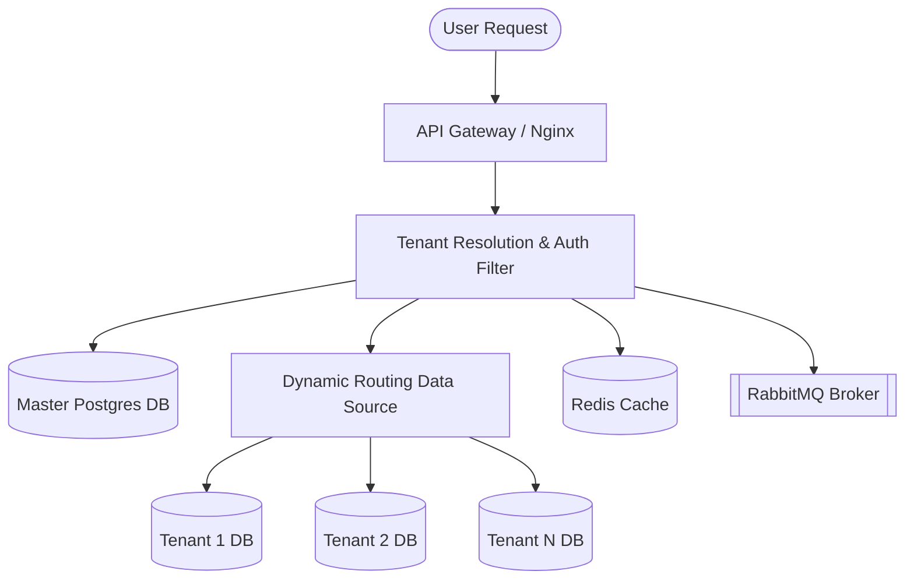
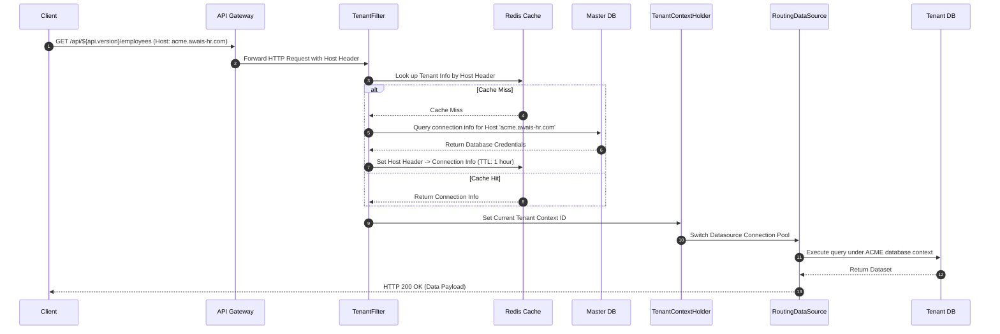
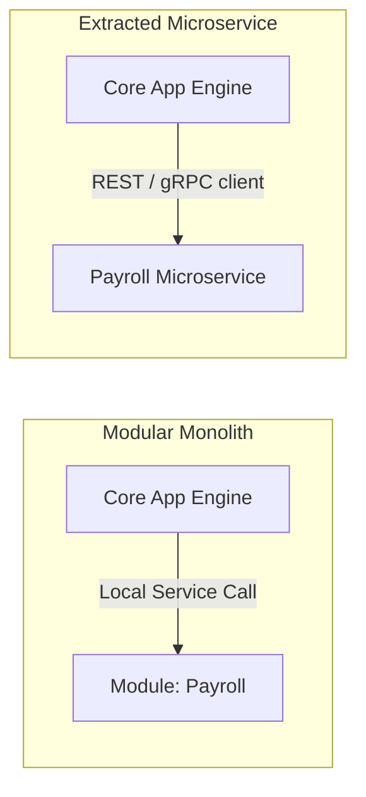
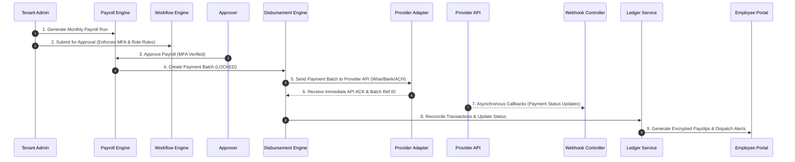

# System Architecture Specification: Awais HR

This document details the software, logical, and physical architecture of the **Awais HR** SaaS platform.

---

## 1. System Overview

Awais HR is built using a cloud-native, microservices-ready modular monolith architecture on **Spring Boot 3.x** and **Java 21**. It utilizes a strict **Database-per-Tenant** design to isolate data, enhance security, and enable custom enterprise schemas while preserving the simplicity of a single application control plane.



---

## 2. Multi-Tenancy Architecture

We employ the **Database-per-Tenant** pattern. The benefits of this approach outweigh the resource overhead:
*   **Benefits:** Strict security compliance (no shared table bugs), simplified database backup/restore per customer, and easy dynamic module migrations.
*   **Trade-off:** Connection pool management overhead. (Mitigated using dynamic connection pooling via HikariCP and idle timeout tuning).

### 2.1. Master Database
The Master database is the registry. It stores:
*   `tenant_registry`: Subdomains, custom domain mappings, status (`PROVISIONING`, `ACTIVE`, `SUSPENDED`).
*   `tenant_connection_details`: Encrypted database host, port, username, password.
*   `subscription_metadata`: Active modules, plan limits, billing renewal dates.

### 2.2. Tenant Databases
Each company gets a separate physical database on PostgreSQL clusters. Cross-tenant queries are physically impossible.

---

## 3. Dynamic Tenant Resolution & Routing

Tenant resolution runs on every API request. The platform resolves the context automatically via the Host Header:



### Spring implementation pattern for Dynamic Routing:
1.  **`TenantContextHolder`:** A thread-local storage holding the resolved tenant identifier for the current HTTP request.
2.  **`TenantResolutionFilter`:** Reads the Host header, queries Redis/Master DB, sets `TenantContextHolder`.
3.  **`DynamicRoutingDataSource`:** Overrides Spring's `AbstractRoutingDataSource.determineCurrentLookupKey()`, which returns the tenant identifier.
4.  **`RoutingDataSourceLookup`:** Spawns and caches `HikariDataSource` connection pools dynamically when a tenant connects for the first time.

---

## 4. Authentication & Authorization (SAML, OIDC, JWT)

Awais HR uses **Spring Security** combined with an external OIDC Provider or local JWT issuance.

### 4.1. The Authentication Lifecycle
1.  **Request:** User submits credentials or OIDC code to `/api/${api.version}/auth/login`.
2.  **Validation:** Backend validates credentials against the **Tenant Database**'s `employee` records.
3.  **Token Issuance:** Backend returns a signed JWT containing:
    *   `sub`: User Subject ID.
    *   `tenant_id`: Resolved Tenant ID.
    *   `permissions`: String-based action keys resolved dynamically from the database based on the employee's assigned custom roles (e.g., `corehr:employee:write`, `payroll:run:execute`).

### 4.2. Authorization: Dynamic Permissions & ABAC
*   **Permission-Based Authorization:** Rather than hardcoding role checks, all API endpoints are protected using Spring Security annotations checking the dynamic permission authorities present in the JWT context: `@PreAuthorize("hasAuthority('payroll:run:execute')")`.
*   **Attribute-Based Access Control (ABAC):** Performs database-level and query-level checks dynamically (such as filtering department hierarchies or ensuring database connections cannot cross active tenant limits). This is implemented using PostgreSQL Row-Level Security (RLS) policies.

---

## 5. Caching & Message Brokering

### 5.1. Redis Caching Topology
*   **Session Storage:** Replicated user sessions across multi-node application deployments.
*   **Routing Directory:** Tenant subdomains/custom domains to connection details mappings (reducing Master DB loads).
*   **Configuration Metadata:** Active module catalogs, industry templates, and system configs.

### 5.2. RabbitMQ Message Distribution
RabbitMQ orchestrates background tasks and event-driven communication:
*   `tenant.provisioning.queue`: Receives tasks to spin up databases, run flyway, and seed initial data.
*   `notifications.queue`: Sends transaction emails, Slack hooks, SMS alerts.
*   `payroll.processing.queue`: Handles long-running payroll calculations asynchronously.

---

## 6. File Storage & Cryptography

Employee records contain highly sensitive details (contracts, passports).
*   **Storage Medium:** AWS S3 or MinIO configured for private read access.
*   **Bucket Isolation:** Files are written to tenant-specific folders: `s3://awais-hr-vault/{tenant_id}/{employee_id}/`.
*   **Encryption at Rest (Envelope Encryption):**
    1.  Generate a unique **Data Encryption Key (DEK)** per file.
    2.  Encrypt document with DEK.
    3.  Encrypt DEK with the **Key Encryption Key (KEK)** retrieved from AWS KMS or HashiCorp Vault for that specific tenant.
    4.  Store the encrypted DEK alongside the file metadata in the tenant DB.

---

## 7. Modular Monolith Design & Microservices Transition Plan

To prevent monolithic spaghetti code while avoiding the complexity of distributed systems on day one, Awais HR is built as a strict **Modular Monolith** on both the backend and frontend.

### 7.1. Backend Module Boundaries
*   **Package by Domain:** Classes are grouped into functional domain modules: `com.awais.hr.module.{domain}` (e.g. `module.employee`, `module.attendance`, `module.payroll`).
*   **Interface-First Communication:** Modules must interact *only* via public service interfaces (e.g. `EmployeeModuleService.java`). Injecting components or repositories from another module's package is strictly prohibited.
*   **No Cross-Database SQL Joins:** A query in the `payroll` module cannot join tables belonging to the `employee` module. Cross-domain queries are resolved at the service layer by calling the target module's API service.
*   **Decoupled Events:** Inter-module actions that do not require transactional consistency are decoupled using Spring Application Events or RabbitMQ messages (e.g. `EmployeeOnboardedEvent` triggers the `asset` module to prepare equipment).

### 7.2. Frontend Module Boundaries
*   **Feature Modules:** Feature-specific pages, components, hooks, and services are grouped in `/src/modules/{feature}` (e.g. `/src/modules/employees/`).
*   **Shared Abstractions:** Core components (buttons, input boxes) and base configurations live in `/src/shared/` or `/src/components/ui/`.
*   **Zero Component Dependencies:** Pages in `/src/app/(dashboard)/employees` load components and hooks strictly from their local `/src/modules/employees/` directory.

### 7.3. Microservices Migration Roadmap
If a module (e.g. `payroll`) requires dedicated scaling, isolated deployments, or separate development teams, it can be extracted with near-zero refactoring:



1.  **Step 1: Extract Database:** Move the target module's database tables (isolated via naming prefixes/schema) to a dedicated PostgreSQL database.
2.  **Step 2: Package Extraction:** Move `com.awais.hr.module.payroll` into a separate Spring Boot application.
3.  **Step 3: Protocol Swap:** Replace the local Spring injection of `PayrollModuleService` in the monolithic application with a REST or gRPC client (e.g., `FeignClient` or WebClient) pointing to the new service endpoint.
4.  **Step 4: Frontend Split:** The self-contained `/src/modules/payroll/` directory can be packaged as a separate micro-frontend or dynamic module and integrated via Next.js Multi-Zones or module federation.

---

## 8. Enterprise Payment Integration Framework Architecture

To support enterprise-scale multi-tenancy, global operations, and financial security, the platform embeds a provider-agnostic, decoupled payment architecture covering two isolated domains:

```mermaid
graph TD
    subgraph Payment Domain 1: SaaS Subscription Billing (Platform Context)
        MasterApp[Platform Master Billing Core] --> SubscriptionStrategy[Subscription Provider Strategy Factory]
        SubscriptionStrategy --> StripeAdapter[Stripe Subscription Adapter]
        SubscriptionStrategy --> PaddleAdapter[Paddle Subscription Adapter]
        SubscriptionStrategy --> LemonAdapter[Lemon Squeezy Adapter]
        SubscriptionStrategy --> PaypalAdapter[PayPal Subscription Adapter]
    end

    subgraph Payment Domain 2: Payroll Salary Disbursement (Tenant Context)
        TenantApp[Tenant Payroll Engine] --> DisbursementStrategy[Payroll Disbursement Provider Factory]
        DisbursementStrategy --> WiseAdapter[Wise Business Adapter]
        DisbursementStrategy --> PayoneerAdapter[Payoneer Batch Adapter]
        DisbursementStrategy --> AchAdapter[ACH / Direct Deposit Adapter]
        DisbursementStrategy --> SepaAdapter[SEPA ISO 20022 Adapter]
        DisbursementStrategy --> LocalBankAdapter[Local Bank API Adapter]
    end
```

### 8.1. Payment Domain 1 — SaaS Subscription Billing
*   **Design Pattern:** Strategy & Adapter Patterns (`SubscriptionPaymentProvider` interface).
*   **Provider Agnosticism:** Core subscription logic operates against generic DTOs (`SubscriptionRequest`, `CheckoutSession`, `InvoiceRecord`). Adding a new payment provider (e.g., Razorpay, Adyen) requires creating a single adapter class implementing `SubscriptionPaymentProvider`.
*   **Webhook & Synchronization Pipeline:** Webhooks from payment gateways hit `/api/${api.version}/suite/billing/webhooks/{provider}`. Webhook signatures are validated using HMAC-SHA256 before emitting `SubscriptionUpdatedEvent` or `InvoicePaidEvent` to update tenant schema limits asynchronously.

### 8.2. Payment Domain 2 — Payroll Salary Disbursement
*   **Non-Custodial Architecture:** The platform never touches, holds, or transfers funds directly. All monetary movements occur strictly via direct client-to-bank API calls or authorized OAuth payment gateway endpoints.
*   **Tenant Credential Isolation:** Provider credentials (API keys, secret tokens, OAuth refresh tokens, bank account numbers) are stored in tenant-isolated databases (`tenant_payment_credential`) encrypted with Envelope Encryption (AES-256-GCM + KMS Key). Cross-tenant credential access is physically impossible.
*   **9-Step Batch Orchestration Workflow:**


### 8.3. Resilience, Security & Compliance
*   **Idempotency Guarantee:** All disbursement API payloads include a unique `X-Idempotency-Key` (`UUIDv4` composed of `tenant_id` + `batch_id` + `payroll_run_id`). Duplicate batch submissions are safely rejected by providers without double-paying employees.
*   **Circuit Breaker & Queueing:** High-volume batch requests are dispatched asynchronously via RabbitMQ (`payroll.disbursement.queue`). Resilience4j Circuit Breakers prevent cascading failures if a bank API experiences downtime.
*   **Compliance:** Fully PCI-DSS compliant (no credit card data stored locally; tokenized checkout sessions used exclusively) and GDPR compliant (bank account details stored in isolated encrypted tenant databases).

