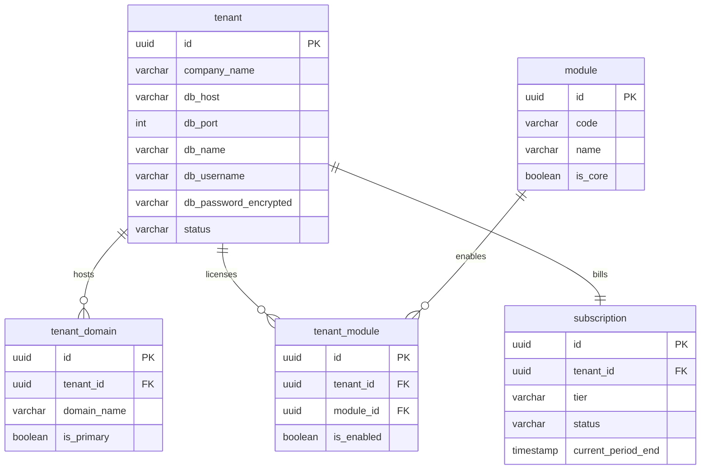

# Database Design Specification: Awais HR

This document details the database architecture, schema layouts, ERD mapping, indexing rules, migration pipelines, and audit strategies for the **Awais HR** platform.

---

## 1. Naming Conventions & Standards

*   **Database Engine:** PostgreSQL 16+.
*   **Case Style:** Lower snake_case (`first_name`, `tenant_id`).
*   **Table Names:** Singular nouns (`employee`, `department`, `leave_request`).
*   **Primary Keys:** Named `id` using random UUID v4 (`uuid DEFAULT gen_random_uuid()`).
*   **Foreign Keys:** `referenced_table_id` (`department_id` references `department.id`).
*   **Boolean Columns:** Prefix with `is_` or `has_` (`is_active`, `has_overtime`).
*   **Timestamp Columns:** Suffix with `_at` stored in UTC (`created_at`, `updated_at`).

---

## 2. Global System Columns & Soft Delete

Every table across master and tenant databases contains these auditing columns:

```sql
ALTER TABLE table_name ADD COLUMN created_at TIMESTAMP WITH TIME ZONE DEFAULT CURRENT_TIMESTAMP NOT NULL;
ALTER TABLE table_name ADD COLUMN updated_at TIMESTAMP WITH TIME ZONE DEFAULT CURRENT_TIMESTAMP NOT NULL;
ALTER TABLE table_name ADD COLUMN deleted_at TIMESTAMP WITH TIME ZONE;
ALTER TABLE table_name ADD COLUMN created_by UUID;
ALTER TABLE table_name ADD COLUMN updated_by UUID;
ALTER TABLE table_name ADD COLUMN deleted_by UUID;
```

### Soft Delete Strategy
*   Soft-deleted records have `deleted_at` set to the timestamp of deletion.
*   All queries executed by the application ORM must append a filter: `WHERE deleted_at IS NULL`.
*   Unique indexes must include the soft delete filter to prevent collisions on historical records:
    ```sql
    CREATE UNIQUE INDEX uq_employee_email ON employee(email) WHERE (deleted_at IS NULL);
    ```

---

## 3. Master Database Schema

The Master database registers tenant connectivity, active domains, subscriptions, and modules.



---

## 4. Tenant Database Schema

Every customer gets a tenant database containing these core tables.

### 4.1. Core HR module tables

```sql
CREATE TABLE permission (
    id UUID PRIMARY KEY DEFAULT gen_random_uuid(),
    code VARCHAR(100) NOT NULL UNIQUE,
    module VARCHAR(50) NOT NULL,
    description VARCHAR(255)
);

CREATE TABLE role (
    id UUID PRIMARY KEY DEFAULT gen_random_uuid(),
    name VARCHAR(100) NOT NULL,
    code VARCHAR(50) NOT NULL UNIQUE,
    is_system BOOLEAN DEFAULT FALSE
);

CREATE TABLE role_permission (
    role_id UUID NOT NULL REFERENCES role(id) ON DELETE CASCADE,
    permission_id UUID NOT NULL REFERENCES permission(id) ON DELETE CASCADE,
    PRIMARY KEY (role_id, permission_id)
);

CREATE TABLE department (
    id UUID PRIMARY KEY DEFAULT gen_random_uuid(),
    name VARCHAR(100) NOT NULL,
    code VARCHAR(20) NOT NULL,
    parent_department_id UUID REFERENCES department(id),
    manager_employee_id UUID, -- Setup later as dynamic circular FK
    created_at TIMESTAMP WITH TIME ZONE DEFAULT CURRENT_TIMESTAMP NOT NULL,
    updated_at TIMESTAMP WITH TIME ZONE DEFAULT CURRENT_TIMESTAMP NOT NULL,
    deleted_at TIMESTAMP WITH TIME ZONE,
    created_by UUID,
    updated_by UUID,
    deleted_by UUID
);

CREATE TABLE employee (
    id UUID PRIMARY KEY DEFAULT gen_random_uuid(),
    employee_code VARCHAR(50) NOT NULL,
    first_name VARCHAR(100) NOT NULL,
    last_name VARCHAR(100) NOT NULL,
    email VARCHAR(255) NOT NULL,
    password_hash VARCHAR(255) NOT NULL, -- Added credentials support
    phone VARCHAR(30),
    joining_date DATE NOT NULL,
    termination_date DATE,
    status VARCHAR(50) NOT NULL, -- ACTIVE, INACTIVE, SUSPENDED
    department_id UUID REFERENCES department(id),
    custom_metadata JSONB DEFAULT '{}'::jsonb, -- dynamic custom fields
    created_at TIMESTAMP WITH TIME ZONE DEFAULT CURRENT_TIMESTAMP NOT NULL,
    updated_at TIMESTAMP WITH TIME ZONE DEFAULT CURRENT_TIMESTAMP NOT NULL,
    deleted_at TIMESTAMP WITH TIME ZONE,
    created_by UUID,
    updated_by UUID,
    deleted_by UUID
);

CREATE TABLE employee_role (
    employee_id UUID NOT NULL REFERENCES employee(id) ON DELETE CASCADE,
    role_id UUID NOT NULL REFERENCES role(id) ON DELETE CASCADE,
    PRIMARY KEY (employee_id, role_id)
);

-- Complete circular dependency for department manager
ALTER TABLE department ADD CONSTRAINT fk_dept_manager FOREIGN KEY (manager_employee_id) REFERENCES employee(id);
```

### 4.2. Attendance & Leave module tables

```sql
CREATE TABLE leave_type (
    id UUID PRIMARY KEY DEFAULT gen_random_uuid(),
    name VARCHAR(50) NOT NULL,
    code VARCHAR(20) NOT NULL,
    accrual_days_per_year NUMERIC(5,2) NOT NULL,
    max_carry_forward NUMERIC(5,2) NOT NULL
);

CREATE TABLE leave_request (
    id UUID PRIMARY KEY DEFAULT gen_random_uuid(),
    employee_id UUID NOT NULL REFERENCES employee(id),
    leave_type_id UUID NOT NULL REFERENCES leave_type(id),
    start_date DATE NOT NULL,
    end_date DATE NOT NULL,
    total_days NUMERIC(5,2) NOT NULL,
    status VARCHAR(30) NOT NULL, -- PENDING, APPROVED, REJECTED
    reason TEXT,
    approved_by UUID REFERENCES employee(id),
    created_at TIMESTAMP WITH TIME ZONE DEFAULT CURRENT_TIMESTAMP NOT NULL
);

CREATE TABLE attendance_log (
    id UUID PRIMARY KEY DEFAULT gen_random_uuid(),
    employee_id UUID NOT NULL REFERENCES employee(id),
    clock_in TIMESTAMP WITH TIME ZONE NOT NULL,
    clock_out TIMESTAMP WITH TIME ZONE,
    clock_in_ip VARCHAR(45),
    clock_out_ip VARCHAR(45),
    clock_in_latitude NUMERIC(10, 8),
    clock_in_longitude NUMERIC(11, 8),
    clock_out_latitude NUMERIC(10, 8),
    clock_out_longitude NUMERIC(11, 8),
    status VARCHAR(30) NOT NULL -- ON_TIME, LATE, MISSING_OUT
);
```

---

## 5. Audit Logging Architecture

We implement a dedicated, trigger-less, high-performance audit system. All write mutations (`INSERT`, `UPDATE`, `DELETE`) write to the `audit_trail` table inside the tenant DB via application Hibernate interceptors or Postgres triggers.

```sql
CREATE TABLE audit_trail (
    id UUID PRIMARY KEY DEFAULT gen_random_uuid(),
    employee_id UUID, -- Actor triggering the change
    action VARCHAR(50) NOT NULL, -- INSERT, UPDATE, DELETE
    table_name VARCHAR(100) NOT NULL,
    record_id UUID NOT NULL,
    old_state JSONB, -- NULL on INSERT
    new_state JSONB, -- NULL on DELETE
    ip_address VARCHAR(45),
    user_agent TEXT,
    created_at TIMESTAMP WITH TIME ZONE DEFAULT CURRENT_TIMESTAMP NOT NULL
);

-- Indexing for compliance querying
CREATE INDEX idx_audit_table_record ON audit_trail(table_name, record_id);
CREATE INDEX idx_audit_employee ON audit_trail(employee_id);
```

---

## 6. Schema Migration & Deployment Strategy

*   **Migration Engine:** Flyway.
*   **Separation:** Migrations are segregated into folders:
    *   `db/migration/master/`: Schema setups for routing database.
    *   `db/migration/tenant/core/`: Baseline schema for all tenants.
    *   `db/migration/tenant/modules/{module_name}/`: Module-specific migrations.
*   **Migration Execution:** When a new tenant is provisioned, the provisioning engine runs Flyway against the newly created database target point. If an existing tenant purchases a new module, only the migrations inside `db/migration/tenant/modules/{module_name}/` are executed.
