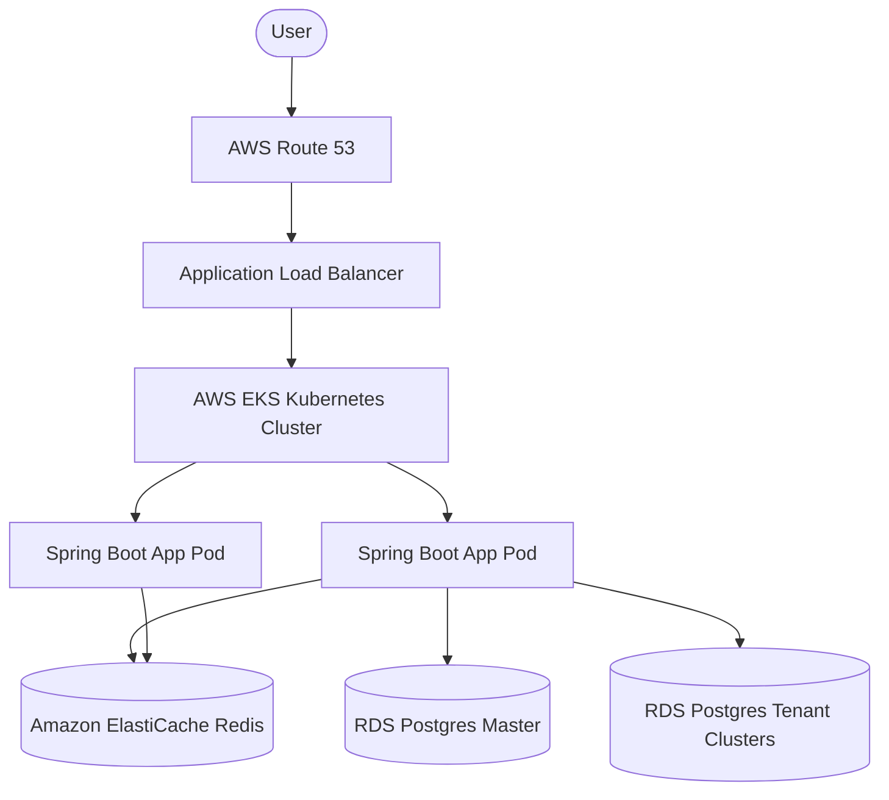

# Technology Stack Decisions & Rationale: Awais HR

This document details the selected technologies, compares them against industry alternatives, and explains the rationale for the choices.

---

## 1. Technical Stack Summary Table

| Category | Chosen Technology | Key Rationale |
| :--- | :--- | :--- |
| **Frontend** | **Next.js 15 (React 19) / JSX** | Native support for React 19 concurrent features, built-in Server Actions, optimized runtime routing, and performance-enhanced UI rendering. |
| **Backend** | **Java 21 / Spring Boot 3.x** | High-performance enterprise platform. Implements `AbstractRoutingDataSource` dynamic multi-tenant pool switching and Java 21 Virtual Threads (Project Loom). |
| **Database** | **PostgreSQL 16+** | Native database per tenant storage engine. Highly optimized JSONB data key querying for dynamic metadata, plus Row-Level Security (RLS). |
| **Caching** | **Redis** | In-memory key-value cache layer used for distributed session replication and tenant routing lookup storage. |
| **Message Broker** | **RabbitMQ** | Native AMQP queuing orchestration to process payroll runs and provisioning workflows asynchronously. |
| **Containerization**| **Docker / Kubernetes** | High-availability scheduling platform enabling pod replication, CPU/Memory checks, and auto-scaling. |
| **IaC** | **Terraform** | Standard infrastructure blueprints for AWS provisioning environments. |

---

## 2. Deep-Dive Rationale

### 2.1. Backend: Java 21 & Spring Boot 3.x
Our backend environment runs Spring Boot 3.x on Java 21. This selection is driven by Spring's native `AbstractRoutingDataSource` routing mechanism. By checking the resolved ThreadLocal context on each incoming API call, the framework switches connection targets seamlessly at runtime. Furthermore, Java 21's Virtual Threads (Project Loom) allow handling millions of simultaneous blockages (such as waiting for tenant connection allocations) without spawning expensive OS-level threads.

### 2.2. Database: PostgreSQL 16+
Each tenant is provisioned with a separate PostgreSQL database. PostgreSQL's native support for JSONB keys allows us to store and query dynamic employee profiles and custom fields using GIN indexes. Additionally, we use native PostgreSQL Row-Level Security (RLS) policies to enforce runtime security boundaries at the database engine level.

### 2.3. Messaging: RabbitMQ
RabbitMQ orchestrates asynchronous data processes. It handles provisioning tasks (dynamic DB creations, Flyway executions) and payroll calculations through flexible routing keys and dead-letter exchanges (DLX) to ensure transactional delivery guarantees.

---

## 3. Infrastructure & Deployment Environment

### Infrastructure Components:
*   **DNS & Custom Domains:** AWS Route 53 wildcard domains (`*.awais-hr.com`) pointing to Nginx Ingress Controllers inside AWS EKS. Custom domain mappings require clients to create CNAME records pointing to `ingress.awais-hr.com`.
*   **Application Hosting:** AWS EKS (Elastic Kubernetes Service) with Horizontal Pod Autoscaler (HPA) scaling pods dynamically based on CPU/Memory usage.
*   **Storage:** Amazon S3 with SSE-S3 encryption and client-side envelope encryption.
