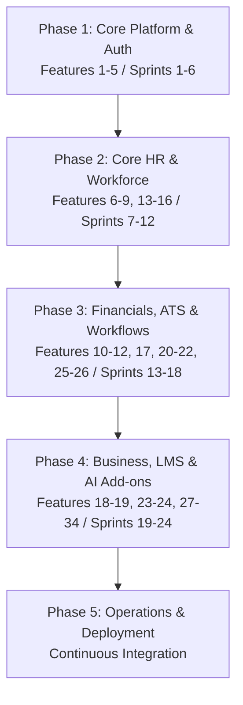

# Project Implementation Plan: Awais HR

This document details the phased implementation roadmap, testing gates, integration stages, and verification checkpoints for the development of **Awais HR**.

---

## 1. Project Phase Rollout Strategy

Development is divided into five primary delivery phases to group our 34 features logically, ensuring structural stability and risk mitigation.

---

## 2. Phase Details & Scope

### Phase 1: Core Platform & Auth (Features 1 to 5 / Sprints 1 to 6)
*   **Focus:** Multi-tenant infrastructure, workspace provisioning, legal entities organization setup, security authentication (MFA/SSO), and dynamic database-driven permissions matrices.
*   **Deliverables:**
    *   Dynamic Host Header routing system with custom routing datasources.
    *   Database schema migrations via Flyway.
    *   Automated registration wizard creating isolated databases dynamically.
    *   Dynamic permission-based authorization (no hardcoded roles).
*   **Verification Gate:** Automated tests verify that registering a user provisions a physical database and enables authentication within that tenant context.

### Phase 2: Core HR & Workforce (Features 6 to 9, 13 to 16 / Sprints 7 to 12)
*   **Focus:** Employee lifecycle directories, ESS/MSS dashboards, geofenced GPS clock-ins, shifting templates, accrual time-off calculations, and holiday calendars mapping.
*   **Deliverables:**
    *   JPA models mapping profile fields and dynamic JSONB attributes.
    *   Leaves accrual engines, weekly rostering calendars, and geofence validators.
    *   ESS/MSS React 19 visual component layouts.
*   **Verification Gate:** Playwright E2E tests verify geofenced clock-in logic and leave requests routing to managers.

### Phase 3: Financials, ATS & Workflows (Features 10 to 12, 17, 20 to 22, 25 to 26 / Sprints 13 to 18)
*   **Focus:** ATS hiring funnel, dynamic onboarding portal checklists, offboarding clearances case tracking, global payroll engines, asset logs, S3 expenses, and dynamic approval builders.
*   **Deliverables:**
    *   Salary components, calculation engines, and dynamic tax compilers.
    *   Career pages, job posting interfaces, candidate pipeline trackers.
    *   Onboarding checklist, expense receipt validation logs, asset inventory.
*   **Verification Gate:** Playwright E2E tests verify onboarding checklists automated creation, and mock payroll sheets calculations correctness.

### Phase 4: Business, LMS & AI Add-ons (Features 18 to 19, 23 to 24, 27 to 34 / Sprints 19 to 24)
*   **Focus:** Goal tracking OKRs, LMS catalog, timesheet logs, help desk, notifications layouts, integrations mappings, AI CV screening, GDPR consent logs, and enterprise multi-country configurations.
*   **Deliverables:**
    *   OKRs key result logs, courses details components, assessments checklists.
    *   SSO Azure/Okta integrations, API access keys, and outbox webhooks.
    *   AI resume screening matching, payroll anomaly alerts.
*   **Verification Gate:** Integration tests run mock SSO log-ins, and mock candidate resumes uploads to verify AI match rating outputs.

### Phase 5: Operations & Deployment (Continuous)
*   **Focus:** Production container configurations, Kubernetes workload definitions, and automated cloud deployments.
*   **Deliverables:**
    *   Automated Docker image construction via Maven build stages.
    *   Kubernetes deployment descriptors, routing service Ingress configs, and volume mounts.
    *   AWS EKS cluster provisioning modules via Terraform.
    *   GitHub Actions CI/CD automation pipelines.
*   **Verification Gate:** Full canary test deploy verifies container configuration loading, health endpoints execution, and Ingress routing rules.
