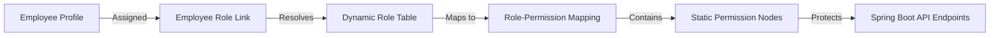

# Dynamic Permission-Based Authorization Specification

This document details the dynamic, permission-based security and authorization model for **Awais HR**.

---

## 1. Authorization Philosophy

To satisfy complex enterprise organizational requirements, Awais HR does **not** use hardcoded role evaluations in the backend code (e.g., checking `hasRole('ROLE_HR_ADMIN')` is forbidden). 

Instead, the authorization system is entirely **Permission-Based**:
1.  **Permissions are Static Key Constants:** Permissions are defined in code by modules (e.g., `corehr:employee:write`, `payroll:run:execute`).
2.  **Roles are Dynamic Sets:** Roles are custom tenant configurations defined in the database. A role (e.g. "Operations Supervisor") is simply a collection of permissions.
3.  **APIs Check Permissions:** Backend controllers check permission authorities directly via Spring Security annotations.
4.  **Runtime Customization:** Tenant administrators can create custom roles, delete roles, or change the permissions mapping of any role at runtime without modifying code or redeploying.



---

## 2. Permissions Database Schema (Tenant Context)

To support dynamic role creation and permission mapping, each tenant database contains the following tables:

```sql
CREATE TABLE permission (
    id UUID PRIMARY KEY DEFAULT gen_random_uuid(),
    code VARCHAR(100) NOT NULL UNIQUE, -- e.g., 'corehr:employee:write'
    module VARCHAR(50) NOT NULL,       -- e.g., 'COREHR'
    description VARCHAR(255)
);

CREATE TABLE role (
    id UUID PRIMARY KEY DEFAULT gen_random_uuid(),
    name VARCHAR(100) NOT NULL,        -- e.g., 'Night Shift Manager'
    code VARCHAR(50) NOT NULL UNIQUE,  -- e.g., 'NIGHT_SHIFT_MGR'
    is_system BOOLEAN DEFAULT FALSE    -- System-seeded defaults (non-deletable)
);

CREATE TABLE role_permission (
    role_id UUID NOT NULL REFERENCES role(id) ON DELETE CASCADE,
    permission_id UUID NOT NULL REFERENCES permission(id) ON DELETE CASCADE,
    PRIMARY KEY (role_id, permission_id)
);

CREATE TABLE employee_role (
    employee_id UUID NOT NULL REFERENCES employee(id) ON DELETE CASCADE,
    role_id UUID NOT NULL REFERENCES role(id) ON DELETE CASCADE,
    PRIMARY KEY (employee_id, role_id)
);
```

---

## 3. Backend Implementation (Spring Security)

### 3.1. Loading Authorities Dynamically
Upon user authentication, the system queries the dynamic mappings and assigns permissions as `GrantedAuthority` objects in the Security context:

```java
@Service
public class UserDetailsServiceImpl implements UserDetailsService {

    @Autowired
    private EmployeeRepository employeeRepository;

    @Override
    @Transactional(readOnly = true)
    public UserDetails loadUserByUsername(String email) {
        Employee employee = employeeRepository.findByEmail(email)
            .orElseThrow(() -> new UsernameNotFoundException("User not found: " + email));

        // Fetch permissions mapped through all assigned roles
        Set<SimpleGrantedAuthority> authorities = employee.getRoles().stream()
            .flatMap(role -> role.getPermissions().stream())
            .map(permission -> new SimpleGrantedAuthority(permission.getCode()))
            .collect(Collectors.toSet());

        return new org.springframework.security.core.userdetails.User(
            employee.getEmail(),
            employee.getPasswordHash(),
            authorities
        );
    }
}
```

### 3.2. Securing API Controllers
Endpoints are protected by checking permissions instead of roles:

```java
@RestController
@RequestMapping("/api/${api.version}/employees")
public class EmployeeController {

    @PostMapping
    @PreAuthorize("hasAuthority('corehr:employee:write')")
    public ResponseEntity<EmployeeResponseDTO> createEmployee(@Valid @RequestBody EmployeeCreateRequestDTO dto) {
        return ResponseEntity.ok(employeeService.create(dto));
    }
}
```

---

## 4. UI/UX Customization (React 19 / JSX)

The client JWT token contains an array of active permission strings. The UI uses custom React helper checks to hide navigation menus and block client routes without performing role assertions:

```javascript
import React from 'react';
import { useAuth } from '../hooks/useAuth';

export function ProtectedComponent({ requiredPermission, children }) {
  const { permissions } = useAuth(); // Reads from decoded JWT payload

  if (!permissions.includes(requiredPermission)) {
    return null; // Do not render UI if permission is missing
  }

  return <>{children}</>;
}
```

*Example Usage in Side Navigation Menu:*
```jsx
<ProtectedComponent requiredPermission="payroll:run:execute">
  <SidebarLink to="/payroll/runs" label="Execute Payroll" />
</ProtectedComponent>
```

---

## 5. Attribute-Based Access Control (ABAC) Layer

While dynamic permissions block or permit API operations, ABAC provides row-level data limits.

### Department Access Predicate
Even if an employee has `corehr:employee:read`, their access is filtered dynamically based on department hierarchies:
1.  **Rule:** A manager can only read employee tables matching their department trees.
2.  **Implementation:** The data query engine appends filtering predicates checking `employee.department_id` against the manager's assigned ID context.
