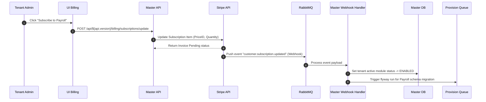

# Subscription & Billing Engine Architecture: Awais HR

This document details the SaaS subscription models, pricing structures, modular add-on gating logic, and Stripe billing pipelines for **Awais HR**.

---

## 1. Plan Tiers & Licensing Structure

Awais HR uses a hybrid pricing model: **Base Tier Price + Per-Employee-Seat Charge + Modular Add-Ons**.

| Plan Tier | Target Segment | Base Price (Monthly) | Per-Seat Price (Monthly) | Included Modules | Feature Limits |
| :--- | :--- | :--- | :--- | :--- | :--- |
| **Starter** | Small business (< 50) | \$49 | \$3 | Core HR, Time off | Max 50 employees, Standard support |
| **Growth** | Medium business (< 250) | \$149 | \$5 | Core HR, Leave, Attendance, Performance | Max 250 employees, Custom Fields |
| **Enterprise**| Large Scale (250+) | \$499 | \$8 | All modules included | Unlimited employees, Dedicated DB cluster |

---

## 2. Dynamic Modular Add-Ons

Tenants can toggle optional modules inside the console. Enabling an optional module dynamically updates their Stripe subscription item quantities:
*   **Recruitment (ATS) Module:** +\$1.50 per seat/month.
*   **Payroll Processing Engine:** +\$2.00 per seat/month.
*   **Asset Management Vault:** +\$1.00 per seat/month.

---

## 3. Stripe Integration & Webhook Flow

The master application synchronizes subscription states with Stripe using webhook notifications.



### Stripe Webhook Security Verification:
To prevent spoofing attacks:
1.  Read the raw request payload bytes.
2.  Extract the `Stripe-Signature` HTTP header.
3.  Verify the signature using Stripe's SDK:
    ```java
    Event event = Webhook.constructEvent(
        payload, 
        sigHeader, 
        stripeWebhookSecret
    );
    ```

---

## 4. Feature Gating & Interceptors

The backend enforces feature access control using a Spring **HandlerInterceptor** that validates active modules in the request thread context.

```java
@Component
public class FeatureGateInterceptor implements HandlerInterceptor {

    @Autowired
    private TenantContextHolder tenantContext;

    @Override
    public boolean preHandle(HttpServletRequest req, HttpServletResponse res, Object handler) throws Exception {
        if (handler instanceof HandlerMethod) {
            HandlerMethod method = (HandlerMethod) handler;
            RequiredModule annotation = method.getMethodAnnotation(RequiredModule.class);
            
            if (annotation != null) {
                String requiredModuleCode = annotation.value();
                boolean isEnabled = tenantContext.getCurrentTenantModules()
                    .contains(requiredModuleCode);
                
                if (!isEnabled) {
                    res.sendError(HttpServletResponse.SC_PAYMENT_REQUIRED, "Module not enabled in subscription");
                    return false;
                }
            }
        }
        return true;
    }
}
```
*Usage on controller routes:*
```java
@PostMapping("/calculate")
@RequiredModule("PAYROLL")
public ResponseEntity<PayrollResponseDTO> runPayroll(...) { ... }
```
