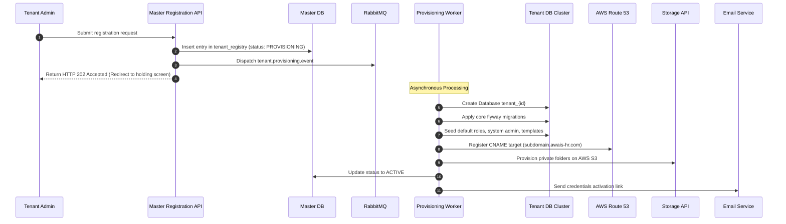

# Automated Tenant Provisioning Pipeline: Awais HR

This document details the architecture, workflows, and configurations of the automated self-service tenant onboarding engine.

---

## 1. Onboarding Pipeline Execution Sequence

The provisioning pipeline executes asynchronously to ensure high API response speed:



---

## 2. Dynamic Database Allocation Implementation

The provisioning worker connects to the tenant database cluster's default administrative pool (e.g. `postgres`) to issue SQL management instructions.

```java
@Service
@Slf4j
public class TenantDatabaseProvisioner {

    @Autowired
    private DataSource masterDataSource; // Admin credentials access to primary database cluster

    public void createPhysicalDatabase(String dbName) {
        String safeDbName = sanitizeDatabaseName(dbName);
        try (Connection conn = masterDataSource.getConnection();
             Statement stmt = conn.createStatement()) {
            
            // Execute physical database creation (PostgreSQL does not support parameterizing db names)
            stmt.executeUpdate("CREATE DATABASE " + safeDbName + " WITH ENCODING = 'UTF8'");
            log.info("Physical database {} created successfully.", safeDbName);
        } catch (SQLException e) {
            throw new DatabaseProvisioningException("Failed to create tenant database " + safeDbName, e);
        }
    }

    private String sanitizeDatabaseName(String name) {
        return name.replaceAll("[^a-zA-Z0-9_]", "");
    }
}
```

---

## 3. Seed Metadata Execution

Once Flyway migrations are complete, the worker initializes the database with defaults depending on the selected **Industry Template** (e.g., healthcare presets, restaurant presets).

Seed categories injected:
1.  **System Roles & Permissions:** Populating `role` and `permission` mapping tables.
2.  **System Accounts:** Creating the primary Tenant Admin employee record.
3.  **Leave Categories:** Pre-loading `Sick Leave`, `Annual Leave`, `Parental Leave` based on local compliance policies.

---

## 4. Routing & Dynamic SSL Configuration

### Subdomain Routing
*   Wildcard CNAME records point to the API Gateway/Load Balancer: `*.awais-hr.com` -> `alb.awais-hr.com`.
*   The Ingress Controller passes the Host Header directly to the application pod.

### Custom Domains Routing (CNAME Mapping)
1.  **Requirement:** Client points their custom domain `hr.clientcompany.com` to `cname.awais-hr.com`.
2.  **Resolution:** When the request enters Ingress, the controller queries our routing context to verify that the custom domain is registered to an active tenant.
3.  **Dynamic SSL Certificates:** We utilize **Traefik Ingress Router** with **Let's Encrypt (ACME)** integration. Traefik dynamically requests and serves SSL certificates on-demand via the TLS-ALPN-01 challenge when a user visits a newly pointed custom domain for the first time.
