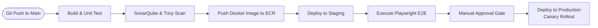

# Production Deployment & Infrastructure Specification: Awais HR

This document details the Infrastructure as Code (IaC), containerization, Kubernetes orchestrations, deployment strategies, and CI/CD pipelines for **Awais HR**.

---

## 1. Containerization (Dockerfile)

We use multi-stage Docker builds to reduce image sizes and isolate development tools from production runtimes. We use an **Eclipse Temurin JDK 21 JRE** alpine base image for production.

```dockerfile
# Stage 1: Build JAR
FROM maven:3.9.6-eclipse-temurin-21 AS builder
WORKDIR /app
COPY pom.xml .
COPY src ./src
RUN mvn clean package -DskipTests

# Stage 2: Runtime image
FROM eclipse-temurin:21-jre-alpine
WORKDIR /app
RUN addgroup -S appgroup && adduser -S appuser -G appgroup
USER appuser
COPY --from=builder /app/target/awais-hr-0.0.1.jar app.jar
EXPOSE 8080
ENTRYPOINT ["java", "-XX:+UseG1GC", "-XX:MaxRAMPercentage=75.0", "-jar", "app.jar"]
```

---

## 2. Infrastructure as Code (Terraform Overview)

The production infrastructure is provisioned on AWS using Terraform modules:
*   `modules/vpc`: Creates isolated subnets across 3 availability zones.
*   `modules/rds`: Provisions PostgreSQL databases for the Master DB and Tenant DB clusters.
*   `modules/elasticache`: Provisions Redis cache clusters.
*   `modules/eks`: Provisions the AWS Kubernetes EKS cluster with autoscaling node groups.

---

## 3. Kubernetes Orchestration Manifest

A sample deployment manifest for the core application pod:

```yaml
apiVersion: apps/v1
kind: Deployment
metadata:
  name: awais-hr-backend
  namespace: production
  labels:
    app: awais-hr-backend
spec:
  replicas: 3
  selector:
    matchLabels:
      app: awais-hr-backend
  template:
    metadata:
      labels:
        app: awais-hr-backend
    spec:
      containers:
      - name: backend
        image: 123456789012.dkr.ecr.us-east-1.amazonaws.com/awais-hr:v1.0.0
        ports:
        - containerPort: 8080
        envFrom:
        - configMapRef:
            name: app-config
        - secretRef:
            name: app-secrets
        resources:
          limits:
            cpu: "2"
            memory: 4Gi
          requests:
            cpu: "1"
            memory: 2Gi
        readinessProbe:
          httpGet:
            path: /actuator/health/readiness
            port: 8080
          initialDelaySeconds: 30
          periodSeconds: 10
        livenessProbe:
          httpGet:
            path: /actuator/health/liveness
            port: 8080
          initialDelaySeconds: 45
          periodSeconds: 15
```

---

## 4. Continuous Integration / Continuous Deployment (CI/CD)

We use **GitHub Actions** for the automation pipeline:



### Deployment Strategy: Canary Release
When new releases are pushed to production:
1.  **Deploy new version:** Spin up a new deployment version containing 10% of overall pod replicas.
2.  **Traffic split:** Nginx Ingress routes 10% of traffic to the new pods.
3.  **Validation window:** Monitor metrics (error rates, response times) for 30 minutes.
4.  **Full rollout:** If no anomalies are detected, scale the new deployment to 100% and scale down the old pods.
