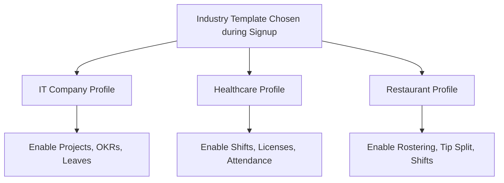

# Industry-Specific Templates Specification: Awais HR

This document details the configuration profiles, pre-enabled modules, metadata settings, and default compliance rules defined for each vertical template during tenant registration.

---

## 1. Industry Selection Strategy

The industry choice made during signup does not restrict future customizations. It is used as a configuration helper that seeds defaults, reducing setup times for HR admins.

---

## 2. IT Company Template Configuration

Designed for technology companies, remote-first startups, and professional services firms.

*   **Pre-Enabled Modules:** Core HR, Leave Management, Performance (OKRs), Projects & Timesheets.
*   **Disabled Modules (Optional):** Shift Scheduling, Asset Tracker.
*   **Default Custom Fields:**
    *   `github_username` (String, Optional)
    *   `tshirt_size` (Enum: S, M, L, XL, XXL)
    *   `work_model` (Enum: REMOTE, HYBRID, ONSITE)
*   **Default Leave Rules:**
    *   Annual Leave: 20 days/year, max carry-forward 5 days.
    *   Sick Leave: 10 days/year, no cash-out value.
*   **Core Workflow Seeded:** "Self-Service Leave approval goes directly to Department Manager; auto-approve if under 3 days."

---

## 3. Healthcare & Hospitals Template Configuration

Designed for hospitals, nursing homes, and medical facilities where compliance tracking and shifting are critical.

*   **Pre-Enabled Modules:** Core HR, Attendance (Biometric & GPS), Shift Management, Leave Management, Asset Management.
*   **Default Custom Fields:**
    *   `medical_license_number` (String, Required)
    *   `license_expiry_date` (Date, Required)
    *   `immunization_status_covid` (Boolean)
*   **Default Leave Rules:**
    *   Annual Leave: 25 days/year, mandatory shift coverage validation before approval.
*   **Core Workflows Seeded:**
    *   "License Expiry Check": Daily task scheduler checks for licenses expiring in under 60 days; issues high-priority notification to HR Admin.
    *   "Shift swap validation": Permits employees to request shift swaps, requiring manager approval before calendar updates.

---

## 4. Restaurants & Hospitality Template Configuration

Optimized for high-turnover shift environments, restaurants, and retail spaces.

*   **Pre-Enabled Modules:** Core HR, Attendance (Tablet Pin Punch-in), Shift Management, Payroll Engine.
*   **Default Custom Fields:**
    *   `food_handler_permit_id` (String)
    *   `preferred_shift` (Enum: MORNING, EVENING, DOUBLE)
*   **Default Leave Rules:**
    *   Casual Leave: Hourly accrual (0.05 hours per hour worked).
*   **Core Workflows Seeded:**
    *   "Overtime Trigger": Flag alerts if an employee exceeds 40 hours in a single week.
    *   "Tip Distribution Log": Submits daily tips metrics directly to the Payroll log interface.
