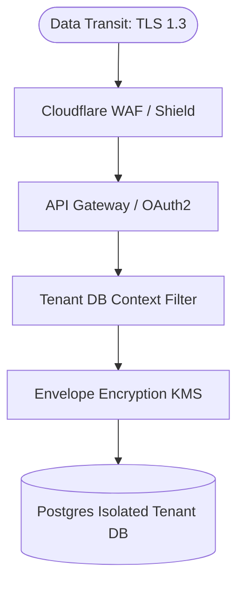

# Security & Compliance Architecture: Awais HR

This document details the security layers, encryption models, identity integrations, and compliance strategies for **Awais HR**.

---

## 1. Security Design Principles

Awais HR is designed to comply with **SOC 2 Type II**, **GDPR**, and **HIPAA** out of the box.



---

## 2. Data Encryption Architecture

### 2.1. Encryption in Transit
*   **Protocol:** TLS 1.3 enforced globally. TLS 1.2 is the absolute minimum fallback, with deprecated cipher suites disabled.
*   **HSTS:** HTTP Strict Transport Security enabled with a `max-age` of 1 year, including subdomains.

### 2.2. Encryption at Rest (Envelope Encryption)
Sensitive database columns (e.g., salary amounts, national IDs, documents) are encrypted using dynamic AES-256 envelope encryption.

```
                  +----------------------------------------+
                  |         AWS KMS / HashiCorp Vault      |
                  +-------------------+--------------------+
                                      |
                                      | Decrypts
                                      ▼
+---------------------+     +------------------+     +------------------------+
|  Encrypted DEK      |---->| Decrypted DEK    |---->| Decrypts plaintext     |
|  (stored in DB row) |     | (stored in RAM)  |     | columns / S3 files     |
+---------------------+     +------------------+     +------------------------+
```

1.  **Key Hierarchy:**
    *   **KEK (Key Encryption Key):** A master customer-managed key stored in AWS KMS or HashiCorp Vault (one per tenant).
    *   **DEK (Data Encryption Key):** A local AES-256 key generated in memory on the application pod.
2.  **Encryption Process:**
    *   Application generates DEK.
    *   Encrypts data with DEK.
    *   Encrypts DEK with KEK via KMS API.
    *   Persists ciphertext and encrypted DEK in database columns. The plaintext DEK is discarded from memory immediately.

---

## 3. Strict Tenant Isolation Verification

To prevent cross-tenant access bugs (e.g., ID harvesting attacks):
*   **Static Code Analysis:** Pre-commit hooks run static analyzers checking for SQL query concatenations.
*   **Connection Interceptor:** Spring JPA connections are wrapper-intercepted. Before any query runs, the wrapper asserts that the active connection URL matches the tenant context ID:
    ```java
    public class ConnectionSanityCheckInterceptor implements ConnectionPrepareStatementInterceptor {
        @Override
        public String onPrepareStatement(String sql) {
            String currentDbName = TenantContextHolder.getCurrentTenantDbName();
            String activeConnDbName = TransactionSynchronizationManager.getCurrentConnectionName();
            if (!activeConnDbName.equals(currentDbName)) {
                throw new TenantDataLeakageException("Connection target mismatch!");
            }
            return sql;
        }
    }
    ```

---

## 4. Identity Integration (OAuth2, OIDC, SAML)

We support local email/password login and external identity providers:
*   **OAuth2 / OpenID Connect (OIDC):** Seamless sign-in with Google Workspace and Microsoft Azure AD.
*   **SAML 2.0:** Required for Enterprise accounts. Supports dynamic metadata URL endpoints for Okta or Ping Identity.
*   **Dynamic Identity Provider (IdP) Selection:**
    1.  User enters email on login screen.
    2.  System queries Master DB registry for the email domain.
    3.  If OIDC/SAML is configured for that tenant, the UI redirects the user to their organization's IdP login screen.

---

## 5. Compliance Matrix Mapping

### 5.1. GDPR Enforcement
*   **Right to Export (Article 20):** HR Admins can run a complete database extraction utility generating a single ZIP file containing all tenant tables in JSON format and folder structures from S3.
*   **Right to Erasure (Article 17):** Triggers physical purge operations. When a tenant is deleted, the database cluster executes `DROP DATABASE tenant_{id}` and clears all corresponding S3 keys.

### 5.2. SOC 2 Type II controls
*   **Access Control audits:** Logs all user login attempts, permission updates, and token issuances to a read-only write-once-read-many (WORM) audit ledger.
*   **Vulnerability Scanning:** Container images are scanned on build using Trivy, blocking releases that contain critical vulnerabilities.
