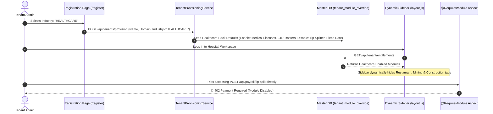

# 🏷️ Tenant Industry Provisioning & Dynamic Feature Isolation Architecture

> [!NOTE]
> **Core Architectural Principle**
> In Awais HR SaaS, **a single hospital, tech company, factory, or hotel tenant only sees and accesses the modules relevant to their industry profile.**
> Non-needy modules (e.g. a Hospital seeing "Restaurant Tip Splitter" or "Factory Piece Rate") are **automatically hidden from the UI navigation** and **blocked at the REST API layer** via Aspect-Oriented Programming (AOP).

---

## 🏗️ 1. End-to-End Tenant Onboarding & Provisioning Flow



---

## ⚙️ 2. Dynamic Feature Entitlement Schema

When a tenant registers, their industry selection automatically seeds default entitlements in the master database (`platform_db`):

```sql
-- Schema: master_db.tenant_module_override
CREATE TABLE tenant_module_override (
    id BIGSERIAL PRIMARY KEY,
    tenant_id VARCHAR(64) NOT NULL,
    module_key VARCHAR(64) NOT NULL,
    is_enabled BOOLEAN NOT NULL DEFAULT true,
    enabled_at TIMESTAMP DEFAULT CURRENT_TIMESTAMP,
    updated_by VARCHAR(64),
    CONSTRAINT uk_tenant_module UNIQUE (tenant_id, module_key)
);
```

### Industry Capability Pack Presets Matrix

| Industry Selected during Registration | Default Enabled Modules (`is_enabled = true`)                                                                    | Default Disabled Modules (`is_enabled = false`)                                               |
| :------------------------------------ | :----------------------------------------------------------------------------------------------------------------- | :---------------------------------------------------------------------------------------------- |
| **🏥 Healthcare & Hospitals**   | `CORE_HR`, `SHIFTS_24_7`, `MEDICAL_LICENSES`, `CLINICAL_LMS`, `HIPAA_AUDIT`, `VISITOR_PASSES`          | `RESTAURANT_TIPS`, `PIECE_RATE_FACTORY`, `STORE_KIOSK`, `OFFSHORE_RIGS`, `DRIVER_DOT` |
| **💻 IT & Tech Services**       | `CORE_HR`, `ATS_PIPELINE`, `AI_RESUME_PARSER`, `OKRS_PERFORMANCE`, `DEVELOPER_API`, `EQUIPMENT_ASSETS` | `PIECE_RATE_FACTORY`, `MEDICAL_LICENSES`, `FOOD_HANDLER_PERMIT`, `CAP_LAMP_MINING`      |
| **🏭 Manufacturing**            | `CORE_HR`, `MULTI_SHIFT`, `BIOMETRIC_SYNC`, `OSHA_SAFETY`, `HEAVY_TOOLS`, `OVERTIME_MULTIPLIERS`       | `RESTAURANT_TIPS`, `DEVELOPER_API`, `PROFESSOR_ATS`, `TENURE_TRACK`                     |
| **🏨 Hospitality (HoReCa)**     | `CORE_HR`, `HOTEL_ROSTERS`, `POS_PUNCH_IN`, `FOOD_PERMITS`, `RESTAURANT_TIPS`, `UNIFORM_ASSETS`        | `MEDICAL_LICENSES`, `OFFSHORE_RIGS`, `DOD_CLEARANCE`, `CIVIL_SERVICE_SCALES`            |

---

## 🎨 3. Frontend Dynamic Navigation Pruning (`layout.js`)

When a user opens their dashboard, the React 19 layout component fetches the tenant's active entitlements and dynamically prunes the menu tree:

```javascript
// Example Dynamic Sidebar Filter Logic (frontend/src/app/(dashboard)/layout.js)
const tenantEntitlements = useTenantEntitlements(); // e.g. ["CORE_HR", "SHIFTS_24_7", "MEDICAL_LICENSES"]

const filteredNavigation = navigationMenu.filter((item) => {
    // If route requires a specific module, verify tenant has it enabled
    if (item.requiredModule) {
        return tenantEntitlements.includes(item.requiredModule);
    }
    return true; // Core features always visible
});
```

### Visual Experience Comparison

#### 🏥 Hospital Workspace View

```
📌 AWAI HR — St. Jude Hospital
├── 👥 Employee Directory
├── 🩺 Medical License Tracker
├── ⏱️ 24/7 Ward Shift Rosters
├── 🎓 Clinical Compliance LMS
├── 🏥 Patient Visitor Passes
└── 💳 Payroll & Direct Disbursement
```

*(Notice: Restaurant Tips, Factory Piece-Rate, and Construction Geofence are 100% invisible!)*

#### 🏨 Hotel & Restaurant Workspace View

```
📌 AWAI HR — Grand Hyatt Hotel
├── 👥 Employee Directory
├── 🍽️ Kitchen & Front-Desk Rosters
├── 🍕 Restaurant Tip Splitter
├── 📜 Food Handler Permits
├── 👔 Hotel Uniform Tracker
└── 💳 Payroll & Service Charge Payouts
```

---

## 🛡️ 4. Backend AOP Entitlement Enforcement (`@RequiresModule`)

To prevent unauthorized access even if someone manually types an API URL in Postman or curl, backend Spring Boot REST controllers are protected by an AspectJ interceptor:

```java
// Controller Protection Example
@RestController
@RequestMapping("/api/payroll/tip-split")
public class TipSplitController {

    @PostMapping
    @RequiresModule("RESTAURANT_TIPS") // Enforces tenant module entitlement
    public ResponseEntity<TipSplitResponse> calculateTips(@RequestBody TipSplitRequest request) {
        return ResponseEntity.ok(tipSplitService.processTipPool(request));
    }
}
```

If a Hospital tenant attempts to call this API, `ModuleAccessAspect` checks Redis/Database cache and rejects the call instantly:

```json
HTTP/1.1 402 Payment Required
Content-Type: application/json

{
  "timestamp": "2026-08-14T14:26:00Z",
  "status": 402,
  "error": "Module Disabled",
  "message": "Module 'RESTAURANT_TIPS' is not enabled for tenant industry plan 'HEALTHCARE'. Visit /marketplace to enable add-ons.",
  "path": "/api/payroll/tip-split"
}
```

---

## 🛒 5. WordPress-Style Marketplace Self-Service Upgrades (`/marketplace`)

If a Hospital has an in-house cafeteria and *wants* to use the Restaurant Tip Splitter module:

1. Tenant Admin visits **`/marketplace`**.
2. Finds the **Restaurant Tip & Pool Distribution Plugin**.
3. Clicks **Toggle Enable / Install Add-on**.
4. The system updates `tenant_module_override`:
   ```sql
   UPDATE tenant_module_override SET is_enabled = true WHERE tenant_id = 'tenant_stjude' AND module_key = 'RESTAURANT_TIPS';
   ```
5. **Instant Live Unlock**: The sidebar updates immediately and REST APIs accept calls without needing app restarts or code deployments!
