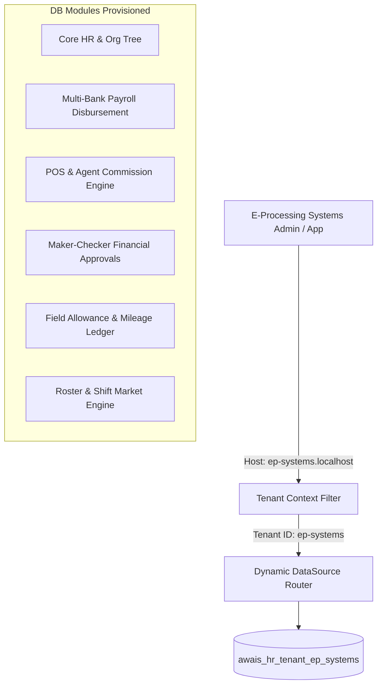

# Enterprise Tenant Analysis & Platform Provisioning Blueprint
## E-Processing Systems (Pvt) Ltd — OneLoad FinTech Platform

---

## 1. Executive Summary & Corporate Profile

| Attribute | Details |
| :--- | :--- |
| **Legal Entity** | E-Processing Systems (Pvt) Ltd |
| **Parent Organization** | Systems Limited (PSX: SYS) |
| **Primary Brand / Platform** | **OneLoad** (Leading Micro-Retailer FinTech & Agent Banking Aggregator) |
| **Headquarters** | Lahore, Punjab, Pakistan |
| **Strategic Backers & Investors** | International Finance Corporation (IFC), Bill & Melinda Gates Foundation |
| **Target Vertical** | FinTech / Retail Payment Aggregation / Micro-Merchant Financial Services |
| **Workforce Scale** | ~1,200+ Full-Time Employees & 50,000+ Field Merchants / Agent Partners |
| **Tenant Subdomain** | `ep-systems.localhost` / `oneload.hr.awaisenterprise.com` |

---

## 2. Business Operations & Workforce Dynamics

E-Processing Systems operates at the intersection of **financial technology**, **telecommunications aggregation**, and **last-mile agent networks**. Its flagship platform, **OneLoad**, enables over 50,000 micro-retailers (kiryana stores) to dispense digital financial services, utility bill payments, mobile top-ups, and bank transfers.

### Workforce Segments & Operational Demands:
1. **Corporate Headquarters & Core Product Team**: Product Managers, Software Engineers, DevOps, Compliance Officers, and Executive Leadership (Salaried, fixed allowance, hybrid work policy).
2. **Field Operations & Territory Management**: Regional Business Managers (RBMs), Territory Sales Officers (TSOs), and Merchant Onboarding Agents (High-volume mileage tracking, commission-based incentives, dynamic field shifts).
3. **24/7 Operations & Customer Support**: Agent Call Center & Risk Monitoring Desk (Rotational 24/7 shifts, overtime calculation, night stipends).

---

## 3. Awais HR SaaS Multi-Tenant Provisioning Architecture

To support E-Processing Systems, the **Awais HR Enterprise SaaS Platform** provisions a dedicated physical MySQL schema (`awais_hr_tenant_ep_systems`) and applies the **`FINTECH_RETAIL`** Capability Pack.



---

## 4. Capability Pack & Feature Configuration

### 4.1 Activated Core Modules
* **Core HR (`corehr`)**: Hierarchical department mapping for HQ, Regional Offices, and Field Territories.
* **Multi-Bank Payroll Disbursement (`bank_payroll` & `payroll_gateway`)**: Automated batch generation for monthly employee salary disbursement via local interbank settlement (1Link / RAST SPI).
* **POS & Agent Commission Engine (`pos_commission` & `commission_rule`)**: Calculates sales incentives for territory managers based on merchant transaction volumes.
* **Maker-Checker Engine (`maker_checker_request`)**: Dual-authorization workflow for salary revisions, expense disbursements, and elevated permission grants.
* **Allowance & Mileage Ledger (`allowance_ledger`)**: Per-kilometer reimbursement tracking for field agents visiting micro-merchants.
* **Shift & Roster Market (`roster_shift_market`)**: Automated 24/7 support desk shift assignment and shift swapping.

---

## 5. Enterprise Schema Mapping & Database Alignment

The physical tenant database `awais_hr_tenant_ep_systems` runs migrations **V1 through V52**, initializing specific tables configured for E-Processing Systems:

### 5.1 Commission Rule & Transaction Ledger (`V52`)
```sql
-- Commission Rules for Territory Sales Officers
CREATE TABLE IF NOT EXISTS commission_rule (
    id VARCHAR(50) PRIMARY KEY DEFAULT (UUID()),
    rule_name VARCHAR(100) NOT NULL,
    industry_code VARCHAR(50) NOT NULL DEFAULT 'FINTECH_RETAIL',
    rule_type VARCHAR(50) NOT NULL, -- VOLUME_TIER, MERCHANT_ONBOARDING
    target_amount DECIMAL(15, 2) DEFAULT 0.00,
    commission_rate DECIMAL(5, 2) NOT NULL,
    status VARCHAR(20) DEFAULT 'ACTIVE',
    created_at TIMESTAMP DEFAULT CURRENT_TIMESTAMP
);

-- Commission Audit Entries
CREATE TABLE IF NOT EXISTS pos_commission (
    id VARCHAR(50) PRIMARY KEY DEFAULT (UUID()),
    employee_id VARCHAR(50) NOT NULL,
    sales_amount DECIMAL(15, 2) NOT NULL,
    commission_rate DECIMAL(5, 2) NOT NULL,
    commission_amount DECIMAL(15, 2) NOT NULL,
    log_date DATE NOT NULL,
    created_at TIMESTAMP DEFAULT CURRENT_TIMESTAMP
);
```

### 5.2 Field Agent Allowance & Mileage Tracker (`V52`)
```sql
CREATE TABLE IF NOT EXISTS allowance_ledger (
    id VARCHAR(50) PRIMARY KEY DEFAULT (UUID()),
    employee_id VARCHAR(50) NOT NULL,
    allowance_type VARCHAR(50) NOT NULL, -- MILEAGE_PER_KM, FIELD_PER_DIEM
    distance_km DECIMAL(10, 2) DEFAULT 0.00,
    unit_rate DECIMAL(10, 2) NOT NULL,
    total_amount DECIMAL(15, 2) NOT NULL,
    trip_date DATE NOT NULL,
    status VARCHAR(20) DEFAULT 'APPROVED',
    created_at TIMESTAMP DEFAULT CURRENT_TIMESTAMP
);
```

### 5.3 Maker-Checker Financial Approvals (`V52`)
```sql
CREATE TABLE IF NOT EXISTS maker_checker_request (
    id VARCHAR(50) PRIMARY KEY DEFAULT (UUID()),
    request_type VARCHAR(50) NOT NULL, -- SALARY_REVISION, BANK_DISBURSEMENT
    maker_employee_id VARCHAR(50) NOT NULL,
    checker_employee_id VARCHAR(50),
    entity_id VARCHAR(50) NOT NULL,
    change_payload TEXT NOT NULL,
    status VARCHAR(30) DEFAULT 'PENDING_CHECKER_APPROVAL',
    requested_at TIMESTAMP DEFAULT CURRENT_TIMESTAMP
);
```

---

## 6. Security, Compliance & Dual-Scope RBAC

E-Processing Systems operates under strict State Bank of Pakistan (SBP) regulatory oversight. Awais HR enforces multi-layer compliance:

### 6.1 Role Permission Hierarchy
```
SYSTEM_ADMIN (Full Platform Access)
 └── HR_DIRECTOR (EP Systems HQ HR Admin)
      ├── FINANCE_CHECKER (Payroll & Disbursement Approver)
      ├── TERRITORY_MANAGER (Department Supervisor)
      └── FIELD_AGENT (Self-Service & Mileage Submission)
```

### 6.2 Compliance & Audit Logs (`V15` & `V47`)
* **GDPR & SBP Data Consent (`gdpr_consent`)**: Encrypted records of employee data processing consent.
* **Compliance Audit Ledger (`compliance_audit_log`)**: Immutable audit trail capturing every `INSERT`, `UPDATE`, and `DELETE` operation across financial ledgers.
* **Encrypted Credentials (`tenant_payment_credential`)**: Payment gateway keys stored using AES-256 encryption.

---

## 7. Tenant Provisioning Commands & Deployment Validation

To provision E-Processing Systems within the platform:

```bash
# Execute Tenant Provisioning CLI / API Endpoint
curl -X POST http://localhost:8080/api/v1/super-admin/tenants \
  -H "Content-Type: application/json" \
  -H "X-SuperAdmin-Key: secret-key" \
  -d '{
    "companyName": "E-Processing Systems (Pvt) Ltd",
    "subdomain": "ep-systems",
    "industryPack": "FINTECH_RETAIL",
    "adminEmail": "hr@ep-systems.com",
    "allocatedSeats": 1500
  }'
```

### Verification Matrix:
1. **Schema Check**: `awais_hr_tenant_ep_systems` created with 52 Flyway migrations applied.
2. **Domain Isolation**: HTTP requests with header `X-Tenant-ID: ep-systems` or hostname `ep-systems.localhost` automatically route to `awais_hr_tenant_ep_systems`.
3. **Data Seeding**: Default roles (`HR_DIRECTOR`, `FINANCE_CHECKER`, `FIELD_AGENT`) and initial platform settings initialized.

---
*Documented for Awais HR Enterprise SaaS Platform Architecture Suite.*
