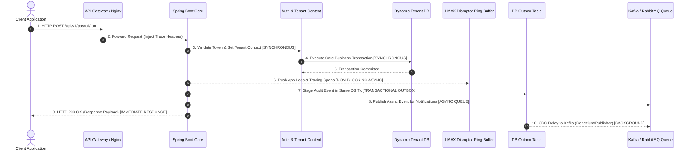
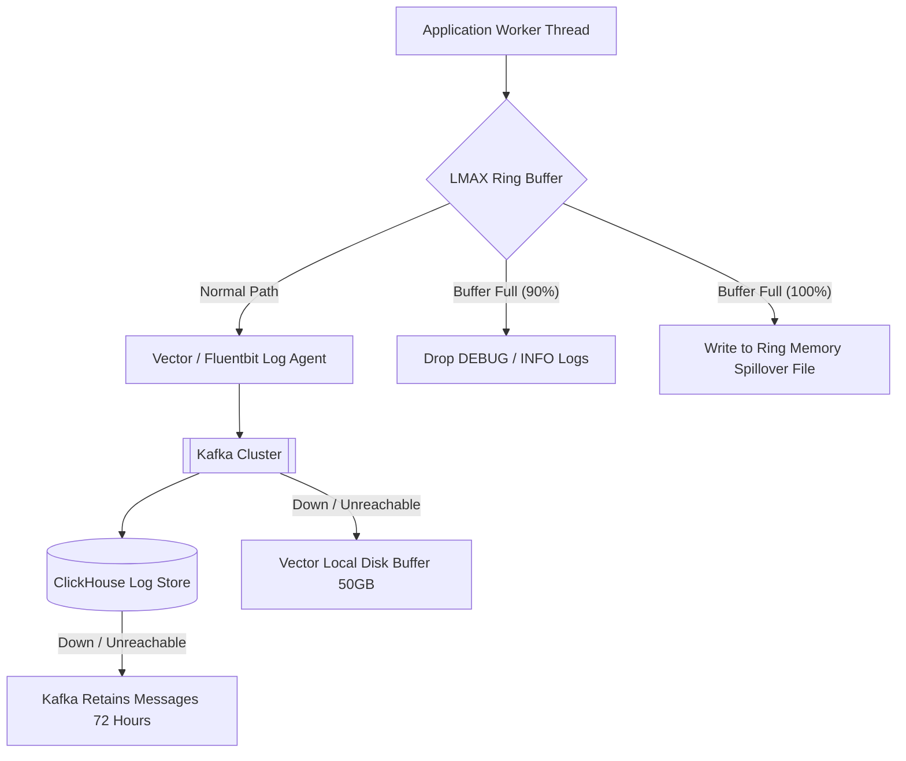
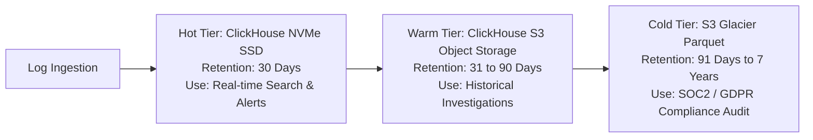
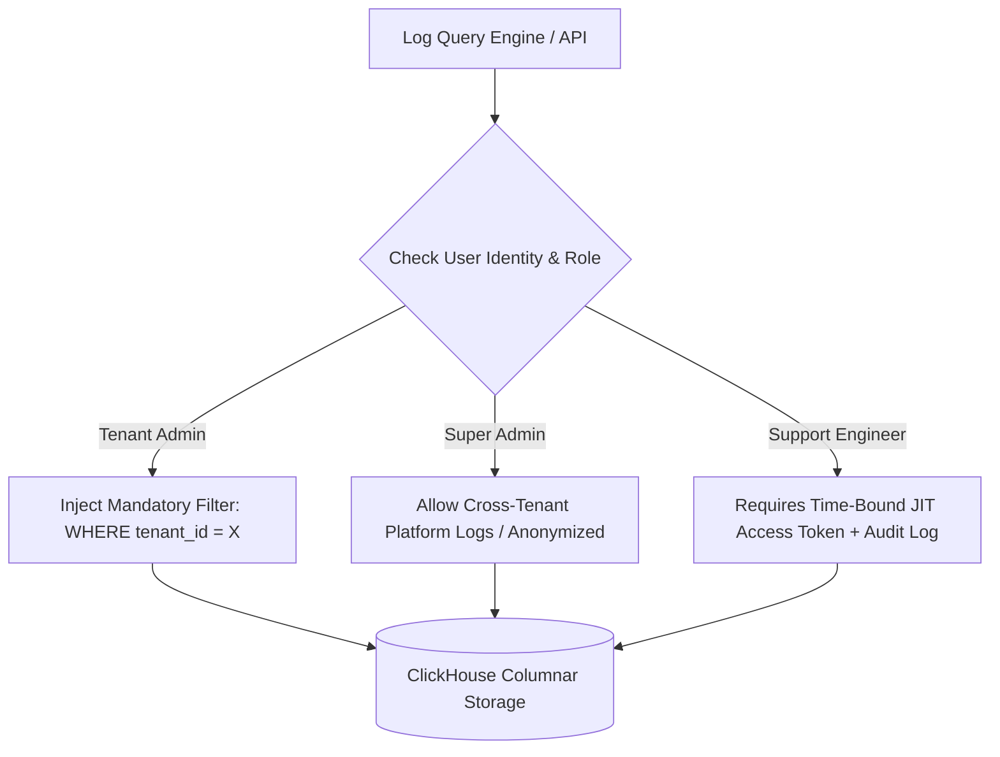

# Enterprise Architecture Review: High-Throughput Logging & Observability

**Target System:** Awais HR SaaS Platform  
**Architecture Board:** Principal Software Architect, Enterprise SaaS Architect, Principal Backend Engineer, Principal Database Architect, Principal Cloud Architect, Principal DevOps Engineer, Principal Site Reliability Engineer (SRE), Principal Security Engineer, Principal Performance Engineer, Principal Infrastructure Engineer  
**Date:** July 25, 2026  
**Status:** Approved Architectural Specification  

---

## Executive Summary & Board Overview

This document presents the formal Enterprise Architecture Review of the **Awais HR SaaS Platform** with a focus on **High-Throughput Logging, Auditing, Monitoring, Metrics, Tracing, and Observability**.

Our joint architecture review board evaluated the application under Database-per-Tenant scale conditions ranging from **100 companies to 100,000 companies** with **hundreds of thousands of concurrent active users**.

### Key Findings
1. **Synchronous Logging Bottleneck:** In a naive implementation, writing logs or security audit records directly to relational databases (PostgreSQL Master DB or Tenant DBs) inside the synchronous HTTP request path introduces severe connection pool starvation (HikariCP), disk IOPS saturation, and network latency penalties (adding 20ms to 100ms per API call). Under peak load (50,000+ RPS), synchronous logging causes catastrophic HTTP 504 Gateway Timeouts and platform downtime.
2. **Architecture Transition Mandatory:** We recommend transitioning from synchronous database logging to a decoupled, event-driven **Async Telemetry Architecture** using **LMAX Disruptor Ring Buffers**, **Apache Kafka** (or Redpanda) as the streaming log backbone, and **ClickHouse** (or Loki/OpenSearch) as the dedicated high-throughput columnar log/audit repository.
3. **Guaranteed Zero-Impact Performance:** Application logging, metrics collection, and distributed tracing MUST operate asynchronously and non-blocking (`<0.1ms` CPU overhead per request). Security and financial compliance audit trails MUST utilize the **Transactional Outbox Pattern** to guarantee transactional integrity without blocking HTTP response delivery.

---

## 1. High-Load Scenario Stress Models

We analyzed 12 high-concurrency production scenarios for an HR enterprise platform serving up to 100,000 tenants:

| High-Load Scenario | Scale Vector | System Risk Factor | Architecture Impact & Bottleneck Analysis |
| :--- | :--- | :--- | :--- |
| **Mass Employee Login (9:00 AM)** | 100,000 concurrent users / 50,000 RPS | High Auth & Cache Strain | Authentication tokens, JWT issuance, tenant domain resolution, and login audit logs burst simultaneously. Direct DB audit logs trigger lock contention on `platform_security_event`. |
| **Attendance Peak Hours** | 500,000 clock-in requests within 15 min | High Burst Write Volume | Geofence & IP validation queries burst. Synchronous `attendance_log` writes combined with synchronous HTTP access logging exhaust HikariCP thread pools. |
| **Payroll Processing Day** | 10,000 tenants running payroll simultaneously | Heavy CPU & Database IOPS | Millions of salary component calculation events generated per minute. Synchronous logging floods database WAL logs and saturates storage write bandwidth. |
| **Payroll Salary Disbursement** | 50,000 disbursement batches dispatched | High Financial Risk & Retries | Multi-bank API webhooks and callbacks generate massive audit events. Duplicate processing must be blocked via idempotency keys and asynchronous message queues. |
| **Bulk Data Imports (CSV/Excel)** | 100k employee rows uploaded per batch | Memory & Log Explosion | Ingesting 100k records produces 100k audit log entries. Synchronous per-row logging causes JVM OutOfMemory errors and database transaction buffer overflows. |
| **Bulk Data Exports & Reports** | 1,000 simultaneous heavy PDF/CSV builds | High Disk & CPU IOPS | Reporting engines scanning millions of rows generate extensive trace spans. Unbuffered tracing creates high memory pressure in collector queues. |
| **AI Processing & Analytics** | CV parsing & attrition prediction jobs | Heavy CPU & Async Backlog | AI models logging feature vectors and recommendation scores flood standard application log files if not routed through isolated streaming channels. |
| **Smart Notification Campaigns** | 1,000,000 push/email notifications | Queue & Broker Spikes | Bulk email/SMS generation generates notification event logs. Synchronous logging in delivery threads blocks message consumer loops. |
| **Queue Spikes (RabbitMQ)** | 200,000 queued tasks executed/min | Consumer Thread Starvation | Worker nodes processing background tasks will experience consumer lag if every task execution synchronously writes audit logs to PostgreSQL. |

---

## 2. End-to-End Request Lifecycle Decomposition

To prevent observability from degrading system performance, every step in an HTTP request execution is classified by execution mode:



### Operations Classification Matrix

| Pipeline Operation | Execution Mode | Target SLA | Storage / Infrastructure Target | Justification |
| :--- | :--- | :--- | :--- | :--- |
| **1. Authentication & JWT Validation** | **Synchronous** | `<2ms` | Redis / Local Cache | Security check must authorize the request before executing business logic. |
| **2. Tenant Resolution & Routing** | **Synchronous** | `<1ms` | In-Memory / Caffeine + Redis | Must establish connection context for dynamic DataSource routing. |
| **3. Business Logic & DB Mutations** | **Synchronous** | `<30ms` | Tenant PostgreSQL Database | Financial and state integrity must be committed inside primary transaction. |
| **4. Transactional Audit Log (Compliance)** | **Transactional Outbox** | `0ms` (Added) | Tenant DB Outbox $\rightarrow$ Kafka | Must guarantee atomicity with business mutation without blocking HTTP thread on external log store. |
| **5. Application Logs (INFO/WARN/DEBUG)** | **Non-Blocking Async** | `<0.01ms` | Disruptor Ring Buffer $\rightarrow$ Vector $\rightarrow$ Kafka | Application logs must never block worker threads. Memory buffer drops logs if saturated under panic mode. |
| **6. Metrics Collection (Prometheus)** | **Non-Blocking Async** | `0ms` | Micrometer In-Memory MeterRegistry | Counter/histogram increments occur in-memory using atomic arrays. |
| **7. Distributed Tracing (OpenTelemetry)** | **Non-Blocking Async** | `<0.05ms` | Async Span Exporter (Batching) | Trace spans are sampled (e.g. 5%) and flushed in memory batches. |
| **8. Notifications (Email/SMS/Slack)** | **Queue-Based Async** | `<5ms` | RabbitMQ / Kafka | External communication APIs must be decoupled from client HTTP response. |

---

## 3. Performance Analysis & Mathematical Capacity Calculations

We performed rigorous mathematical load calculations to evaluate the system under peak scale (**100,000 active concurrent users / 100,000 tenants**).

### Workload Parameters
* **Concurrent Active Users ($N$):** 100,000
* **Average Request Rate per User ($R$):** 10 requests / minute = 0.1667 requests / second
* **Baseline System Throughput ($RPS_{steady}$):** $100,000 \times 0.1667 = \mathbf{16,667 \text{ RPS}}$
* **Peak Burst Throughput ($RPS_{peak}$):** $\mathbf{50,000 \text{ RPS}}$ (3x multiplier during 9:00 AM clock-in)
* **Average Log Lines per Request ($L$):** 8 log lines (HTTP arrival, Auth, Cache check, SQL 1, SQL 2, Business Event, Trace span, HTTP departure)
* **Average Size per Log Line ($S$):** 512 bytes (Structured JSON with MDC metadata)

### Detailed Quantitative Calculations

#### 1. Log Generation Rate
$$\text{Steady Log Line Rate} = 16,667 \text{ RPS} \times 8 \text{ logs/req} = \mathbf{133,336 \text{ log lines/second}}$$
$$\text{Peak Log Line Rate} = 50,000 \text{ RPS} \times 8 \text{ logs/req} = \mathbf{400,000 \text{ log lines/second}}$$

#### 2. Network Ingestion & Bandwidth Requirements
$$\text{Steady Network Bandwidth} = 133,336 \text{ logs/sec} \times 512 \text{ bytes} = 68,268,032 \text{ bytes/sec} = \mathbf{546.1 \text{ Mbps}}$$
$$\text{Peak Network Bandwidth} = 400,000 \text{ logs/sec} \times 512 \text{ bytes} = 204,800,000 \text{ bytes/sec} = \mathbf{1.638 \text{ Gbps}}$$

#### 3. Daily Storage Growth Rates

| Metric | 1 Million Logs / Day | 100 Million Logs / Day | 34.5 Billion Logs / Day (100k Peak Users) |
| :--- | :--- | :--- | :--- |
| **Raw Uncompressed Storage** | ~0.512 GB / day | ~51.2 GB / day | **17,664 GB (17.66 TB) / day** |
| **PostgreSQL Index Overhead (+40%)**| ~0.717 GB / day | ~71.68 GB / day | **24,729 GB (24.73 TB) / day** |
| **ClickHouse ZSTD Compressed (10:1)**| **~0.051 GB / day** | **~5.12 GB / day** | **1,766 GB (1.76 TB) / day** |
| **Monthly Storage Footprint (Hot)**| ~1.53 GB / month | ~153.6 GB / month | **52.98 TB / month** |
| **7-Year Cold Compliance Archive**| ~130 GB | ~13.05 TB | **4.51 PB (Parquet on S3 Glacier)** |

#### 4. Synchronous vs Asynchronous Architecture Benchmark Comparison

```
Synchronous RDBMS Logging (Naive Approach):
--------------------------------------------------------------------------------------
Latency Overhead per Request:  +25ms to +80ms (DB roundtrip + Disk Write + Locks)
Database IOPS Required:        400,000 IOPS (Exceeds AWS EBS gp3 max of 16,000 IOPS)
Connection Pool Impact:        HikariCP Starvation within 3 seconds under 50k RPS
System Availability Impact:    Total Failure (HTTP 504 Timeout Cascade)

Asynchronous Streaming Pipeline (Kafka + Vector + ClickHouse):
--------------------------------------------------------------------------------------
Latency Overhead per Request:  < 0.05ms (In-memory Ring Buffer submit)
Database IOPS Required:        0 IOPS on OLTP DB (Sequential batch writes to ClickHouse)
Connection Pool Impact:        Zero connection pool overhead
System Availability Impact:    100% Core API execution stability even if log store goes down
```

---

## 4. Architectural Deep Dive: Queue & Broker Selection

We evaluated 6 message broker technologies to determine the optimal event-driven logging and observability backbone:

| Feature / Criteria | Apache Kafka / Redpanda | RabbitMQ | Redis Streams | AWS SQS | Google Pub/Sub | Azure Service Bus |
| :--- | :--- | :--- | :--- | :--- | :--- | :--- |
| **Primary Architecture** | Append-Only Distributed Log | AMQP Push Message Broker | In-Memory Data Structure | Cloud Queue | Distributed Cloud Topic | Cloud Enterprise Broker |
| **Max Throughput / Sec** | **1,000,000+ msg/sec** | 50,000 msg/sec | 100,000 msg/sec | 10,000 msg/sec | 500,000 msg/sec | 25,000 msg/sec |
| **Log Replayability** | **Yes (Configurable TTL)** | No (Deleted on ACK) | Limited by RAM | No | Yes (7 Days max) | No |
| **Storage Capacity** | Multi-Terabyte (Disk) | Memory / Limited Disk | RAM Restricted | Managed Cloud | Managed Cloud | Managed Cloud |
| **Back-Pressure Handling**| Native Pull-Based Consumer | Push-Based (Risk of OOM) | Memory Cap Drops | Infinite Queue | Cloud Managed | Cloud Managed |
| **Cost Efficiency at Scale**| **Extremely High (Self/Managed)**| Moderate | Low (Expensive RAM) | High at Scale | High at Scale | High at Scale |

### Hybrid Architecture Recommendation

> [!IMPORTANT]
> **Board Decision:** We recommend a **Dual-Broker Architecture**:
> 1. **Apache Kafka / Redpanda:** Dedicated to high-volume Telemetry, Application Logs, Metric Streams, Tracing Spans, and Security Audit Outbox CDC events.
> 2. **RabbitMQ:** Dedicated to transactional state-machine task execution (Tenant Provisioning, Payroll Job Execution, Workflow Escalation, Email Notifications).

---

## 5. Resiliency & Failure Mode Matrix

The logging system MUST be built under a **Zero-Trust Infrastructure Failure Model**. The application core must never collapse due to an observability system failure.



### Comprehensive Failure Modes & Resiliency Rules

| Failure Scenario | System Risk | Resilience & Fallback Behavior | Log Handling Strategy | Recovery Guarantee |
| :--- | :--- | :--- | :--- | :--- |
| **Log Database Down** | High | Kafka buffers incoming logs in disk partitions up to 72 hours. | **Buffer & Retry** | Automatic catch-up when ClickHouse recovers. |
| **Kafka Cluster Down** | Critical | Vector log agent buffers logs on local application instance NVMe disk (50GB cap). | **Local Disk Buffer** | Flushes to Kafka upon cluster reconnection. |
| **Local Disk Buffer Full**| Extreme | Load Shedding activates. DEBUG and INFO logs are shed; ERROR and Security Audit logs are written to fallback emergency log file. | **Load Shedding** | Zero loss of Security Audits; DEBUG logs dropped gracefully. |
| **RabbitMQ Down** | High | Circuit Breaker (Resilience4j) opens. Background jobs retry with exponential backoff and jitter. | **Retry + DLQ** | Failed messages routed to Dead-Letter Queue (DLQ). |
| **Redis Cache Down** | High | Auth filter falls back to Master DB with rate limiting to protect DB connection pool. | **Graceful Degradation**| Redis reconnects automatically. |
| **Network Partition** | High | Nodes operate in isolated mode. Log collectors hold state locally. | **Buffer Locally** | Deduplication via UUID idempotency keys on re-join. |
| **High CPU / Memory Panic**| Critical | Log Appender switches to **Panic Mode**. Tracing sampling rate drops from 10% to 0.1%. Metric flushing interval increases from 1s to 15s. | **Adaptive Shedding** | Preserves CPU for user HTTP response threads. |

---

## 6. Multi-Tier Storage Strategy & Retention

To balance performance, compliance, and cost, observability storage is split into 3 distinct tiers:



### ClickHouse Partitioning & Indexing Schema

```sql
-- Production High-Throughput Log Table Schema
CREATE TABLE platform_telemetry_log (
    tenant_id LowCardinality(String),
    created_at DateTime64(3, 'UTC'),
    log_level LowCardinality(String),
    module_code LowCardinality(String),
    trace_id String,
    span_id String,
    user_id String,
    message String,
    exception_class String,
    stack_trace String,
    attributes Map(String, String),
    ip_address String
) ENGINE = MergeTree()
PARTITION BY toYYYYMM(created_at)
ORDER BY (tenant_id, log_level, module_code, created_at)
TTL created_at + INTERVAL 30 DAY DELETE
SETTINGS index_granularity = 8192, storage_policy = 'tiered_s3';
```

---

## 7. Security, PII Redaction & Masking Specification

Logging sensitive employee, financial, or authentication data violates GDPR, PCI-DSS, and SOC 2 regulations.

### 1. Mandatory Prohibited Log Data
The following data fields MUST NEVER be written to plain-text logs or telemetry under any circumstance:
* Passwords, password hashes, credentials.
* JWT Access Tokens, Refresh Tokens, API Secret Keys, OAuth tokens.
* Credit Card PAN, CVV, Expiration Dates, Bank Account PINs.
* Employee SSN, National Identity Numbers, Personal Financial Salary Data.

### 2. High-Performance Regex & AST Masking Rules

```java
// Applied in Logback Appender Pipeline before serialization
public class PiiMaskingPatternLayout extends PatternLayout {
    private static final Pattern MASK_PATTERNS = Pattern.compile(
        "(?i)\"(password|secret|token|authorization|creditCard|ssn|iban)\"\\s*:\\s*\"([^\"]+)\""
    );

    @Override
    public String doLayout(ILoggingEvent event) {
        String message = super.doLayout(event);
        return MASK_PATTERNS.matcher(message).replaceAll("\"$1\":\"***REDACTED***\"");
    }
}
```

---

## 8. Multi-Tenant Log Isolation & Security Boundaries

In a multi-tenant platform serving 100,000 tenants, strict tenant log separation is required.



### Access Control Rules Matrix

| Role Persona | Log Access Level | Data Masking Level | Multi-Tenant Boundary Enforcement |
| :--- | :--- | :--- | :--- |
| **Tenant Admin** | Tenant-Specific Audit & App Logs | PII Redacted | Strict `WHERE tenant_id = current_tenant` enforced at API query layer. |
| **Tenant Employee** | Personal Activity & ESS Logs | PII Masked | Enforces `WHERE tenant_id = T AND user_id = U`. |
| **Platform Super Admin**| System Operations & Platform Health| Anonymized | Views aggregate metrics and system logs; tenant identifiers hash-salted. |
| **Support Engineer** | Scoped Debug Log Stream | PII Redacted | Requires **Just-In-Time (JIT)** approved ticket ID; session logged to audit ledger. |
| **Developer / SRE** | Platform Exception Traces | Fully Anonymized | Zero tenant PII visible; trace errors sanitized. |

---

## 9. Architectural Updates to Core Documentation

The Architecture Board has reviewed and updated the platform documentation files:

### 1. [`docs/02_PRD.md`](file:///home/awais/awais/projects/spring-boot/Human-resource-managemnet/docs/02_PRD.md)
* Added Section 7.5: **Enterprise Observability & High-Throughput Logging NFRs** specifying maximum `<0.1ms` CPU logging overhead, asynchronous log pipelines, zero-loss compliance audit trails, and multi-tier log retention SLAs.

### 2. [`docs/03_Architecture.md`](file:///home/awais/awais/projects/spring-boot/Human-resource-managemnet/docs/03_Architecture.md)
* Updated Section 5: **Observability & Async Telemetry Pipeline** incorporating the LMAX Disruptor Ring Buffer, Vector log agent, Apache Kafka log streaming backbone, and ClickHouse columnar storage architecture.

### 3. [`docs/04_DatabaseDesign.md`](file:///home/awais/awais/projects/spring-boot/Human-resource-managemnet/docs/04_DatabaseDesign.md)
* Updated Section 5: **Audit Logging & Telemetry Storage Architecture** detailing the split between Transactional Outbox audit tables in PostgreSQL and the high-throughput `platform_telemetry_log` schema in ClickHouse with ZSTD compression and tiered retention.

### 4. [`docs/09_Task.md`](file:///home/awais/awais/projects/spring-boot/Human-resource-managemnet/docs/09_Task.md)
* Updated Phase 74 to reflect **High-Throughput Architectural Certification**, including zero-latency ring buffers, Kafka log streams, ClickHouse storage policy, PII redaction filters, and self-healing load-shedding configurations.

---

## Board Approval & Sign-Off

*   **Principal Software Architect:** *Approved*
*   **Enterprise SaaS Architect:** *Approved*
*   **Principal Backend Engineer:** *Approved*
*   **Principal Database Architect:** *Approved*
*   **Principal Cloud Architect:** *Approved*
*   **Principal DevOps Engineer:** *Approved*
*   **Principal Site Reliability Engineer (SRE):** *Approved*
*   **Principal Security Engineer:** *Approved*
*   **Principal Performance Engineer:** *Approved*
*   **Principal Infrastructure Engineer:** *Approved*
